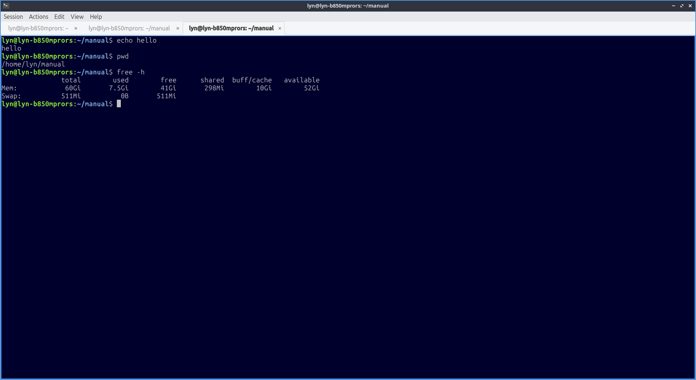
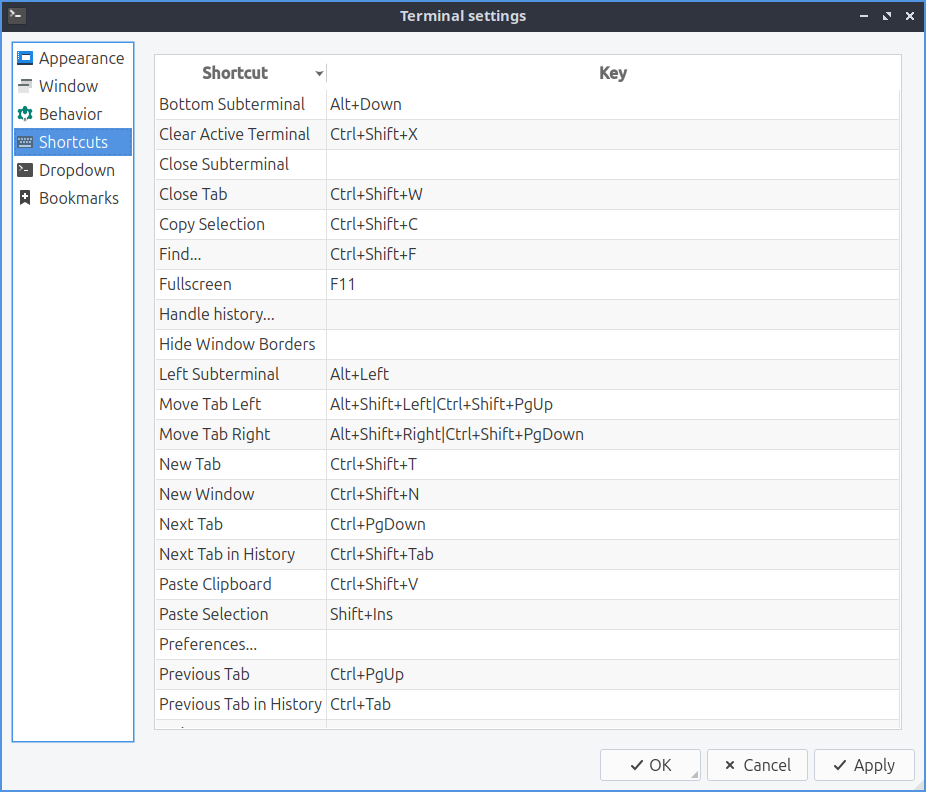

Chapter 3.1.2 QTerminal
=======================

QTerminal is the default terminal of Lubuntu. It also has a drop down version. If you want to learn more about the actual commands you run in the terminal see `Appendix C <https://manual.lubuntu.me/C/command_line.html>`_

Usage
------
To enter a command into QTerminal type the command in and press :kbd:`Enter`. After you do this the command will display its output on the line below where you have entered it.

To open a new tab go to the :menuselection:`Session --> New Tab` or press :kbd:`control + shift + t`. You can also open a new tab by double clicking empty space on the tab bar. To close a tab press the :guilabel:`X` button near the right hand side of the tab, :menuselection:`Session --> Close Tab`, or press :kbd:`Control+Shift+W`. You can change between tabs by left clicking on the tabbar on the tab you want to switch to. To open a new tab with 2 terminals split top bottom select :menuselection:`Session --> New Tab From Preset --> 2 Horizontal terminals`. To have one split terminal left and right next to each other :menuselection:`Session --> New Tab From Preset --> 2 Vertical Terminals`. To open a new tab with 4 terminals use :menuselection:`Session --> New Tab From Preset --> 4 Terminals`. If you want to switch between tabs click on the different click on that tab or press the left and right arrows in the upper right corner to see different tabs if you can't see them all. Another way to switch between tabs is :kbd:`control + page up` or :kbd:`control + page down`.

If you want to copy text from the terminal press :kbd:`control +  shift + c`  or :menuselection:`Edit --> Copy Selection` to copy text. If you wish to paste text into the terminal you can :kbd:`control + shift + v`, right click and select :menuselection:`Paste Clipboard`, or :menuselection:`Edit --> Paste Clipboard` however you should be really careful it is not a malicious command and shows the command you are pasting in. If you want to paste selected text in the terminal press :kbd:`Shift + Insert` or :menuselection:`Edit --> Paste Selection`. If you want to open a new terminal window :kbd:`Control+ Shift+ N` or go :menuselection:`Session --> New Window`. To try to autocomplete the command you type in a command line press the :kbd:`Tab` key. To see what else a command could be hit :kbd:`Tab` twice. 

If you get a URL in your terminal you can right click :menuselection:`Copy Link Address` to copy the link. To open your link directly press :kbd:`Control + left click` or right click on the link and select :menuselection:`Open Link`. To zoom in on the terminal press :kbd:`Control + Shift + +`, :menuselection:`Edit --> Zoom in`, or right click and select :menuselection:`Zoom in`. To zoom out press :kbd:`Control + -`, :menuselection:`Edit --> Zoom out`, or right click :menuselection:`Zoom out`. To return to the original zoom press :kbd:`Control + 0`, :menuselection:`Edit --> Zoom reset`, or right click and select :menuselection:`Zoom reset`. If you want QTerminal to be fullscreen press :kbd:`F11` or :menuselection:`View --> Fullscreen` to make it fullscreen then :kbd:`F11` or :menuselection:`View --> Fullscreen` again to make it back to its original size.

To scroll upward in QTerminal scroll upwards with the mousewheel and you can see the results of previous commands you have run. To scroll downward scroll downward on the mousewheel. To go all the way back to the bottom start typing and it will focus on the bottom.

To split your terminal vertically into two terminals on top of each other :menuselection:`Actions --> Split View Top-Bottom`. To have one  split terminal to the left and one to the right :menuselection:`Actions --> Split View Left-Right`. To collapse back to how your terminal back to how they were before :menuselection:`Actions --> Collapse Subterminal`. To switch between the two split terminals click on the terminal you want. To switch to the lower split terminal press :kbd:`Alt + Down arrow` or :menuselection:`Actions --> Bottom Subterminal`. To switch the top subterminal press :kbd:`Alt + Up arrow` or :menuselection:`Actions --> Top Subterminal`. To switch to the left subterminal press :kbd:`Alt +Left arrow` or :menuselection:`Actions --> Left Subterminal`. To switch to the right subterminal press :kbd:`Alt +Right arrow` or :menuselection:`Actions --> Right Subterminal`. 

To change to the next tab using the keyboard press :kbd:`Control + Page Down` or :menuselection:`Actions --> Next tab`. To change to the previous tab using the keyboard press :kbd:`Control+ Page up` or :menuselection:`Actions --> Previous Tab`. To move to a tab to the right :menuselection:`Actions --> Move tab to the right` or press :kbd:`Alt + Shift + Right Arrow`. To move a tab to the left :menuselection:`Actions --> Move tab to the left` or press :kbd:`Alt + Shift + Left arrow`. To go to a particular tab :menuselection:`Actions --> Go to --> tab x` where x is the tab you want to go to.To move to the tab you had before :menuselection:`Actions --> Previous Tab in History` or press :kbd:`Control+ Tab`. To move to the next tab before that :menuselection:`Actions --> Next Tab in History` or press :kbd:`Control+ Shift + Tab`.
 
To bring a search for the text displayed on your terminal press :kbd:`Control +Shift +F` or :menuselection:`Actions --> Find...`. To close the search bar press :kbd:`Escape`, the :guilabel:`x` button, or :kbd:`Control+Shift+F` again. To find what you need to search for in the :guilabel:`Find` search bar. To move to the next result press the :guilabel:`rightward pointing arrow` button. To move to the previous result is to press the :guilabel:`leftward pointing arrow`. To change to not to match case press the gear button uncheck the :guilabel:`Match Case` checkbox. To toggle highlighting all matches check/uncheck the :guilabel:`Highlight all matches` checkbox. To use a regular expression click the downward pointing arrow button and check the :guilabel:`Regular expression` checkbox. 

To clear you active terminal press :kbd:`Control + Shift +X`, right click :menuselection:`Clear Active Terminal`, or :menuselection:`Actions --> Clear Active Terminal`. To toggle hiding window borders, window decoration, and the window titlebar check the :menuselection:`View --> Hide Window Borders` or right click and select :menuselection:`Hide Window Borders`. To toggle showing the entire menubar press :kbd:`Control+Shift+M` or right click on the :menuselection:`Toggle Menu` then do the same thing to get the menu back again. To toggle showing the tab bar :menuselection:`View --> Show Tab Bar`. To change which side of the terminal the tab bar is :menuselection:`View --> Tabs Layout`.

To use the drop down function of QTerminal once launched press :kbd:`F12` to have the terminal drop down or roll up. When you click outside the drop down terminal it will autohide. If you don't want QTerminal to autohide press the lock button on the upper right hand side. To have QTerminal drop down autohide again unclick the lock button.

To rename a tab press :kbd:`Alt+Shift+S` or right click on the tab bar and select :menuselection:`Rename session` and then press the :guilabel:`OK` button in the popup. To change the color of the tab :menuselection:`Change title color` menuselection. You can also close a tab by right clicking on it and select :menuselection:`Close session`. To view your history in a separate program you set in preferences :menuselection:`Actions --> Handle history`.

Customizing
-----------

To change your preferences go to :menuselection:`Session --> Preferences` or right click the terminal and :menuselection:`Preferences`. The :guilabel:`Appearance` tab shows how the terminal looks. To change your font press the :guilabel:`Change` button next to the :guilabel:`Font` label and a dialog will show up. To change the font size enter it in the :guilabel:`Size` field. The terminal works best with monospaced fonts which often have mono somewhere in their name. To change your font use the :guilabel:`Font` drop down. To see how your font looks look in the :guilabel:`Preview` field.

The :guilabel:`Color scheme` field lets you say change how different colored things in the terminal colors appear. The :guilabel:`Widget style` lets you overwrite the system widget style with something other than system default. The :guilabel:`Scrollbar position` lets you move the scrollbar to the :menuselection:`Left`, :menuselection:`Right`, or :menuselection:`No scrollbar`. The :guilabel:`Tabs position` moves the tabbar to the direction of the side of  the QTerminal window you select. The :guilabel:`Cursor shape` changes the shape of the cursor between block cursor a large block, underline cursor a small underline, or IBeamCursor which is quite small like a | character. 

To use a bold font for bright colors with syntax highlighting check the :guilabel:`Use bold font face for intense colors` checkbox. To disable using the alt key in keyboard combos to activate the window for QTerminal check the :guilabel:`No menu bar accelerator` checkbox. To toggle showing the menubar check/uncheck the :guilabel:`Show the menu bar` checkbox. To hide window borders check the checkbox :guilabel:`Hide Window Borders`. The checkbox :guilabel:`Hide tab bar with only one tab` hides the tab bar when you only have one tab. The checkbox :guilabel:`Fixed tab width` limits how wide a tab can be in pixels. The :guilabel:`Show a border around the current terminal` shows a border around the terminal. To disable having the x button to close each tab uncheck the :guilabel:`Close button on each tab` checkbox. The checkbox :guilabel:`Show terminal size on resize` toggles showing the terminal size on resizing the window. To have support for languages with both right to left and left to right text check the :guilabel:`Enable bi-directional text support`. To use box drawing character from the font you use check the :guilabel:`Use box drawing characters contained in the font` checkbox.

The field :guilabel:`Terminal transparency` gives you the percent transparent for the full application transparency. The field :guilabel:`Terminal transparency` is how transparent to make the terminal. To select a background image for your terminal press the :guilabel:`Select` button next to :guilabel:`Background image`. To change what QTerminal will do with the background image if the window doesn't exactly fit use the :guilabel:`Background mode` menu. The field :guilabel:`Start with preset` lets you choose how many terminal splits to have when you start up QTerminal. To have a margin on the left side of the terminal set the :guilabel:`Terminal margin` will make a margin at the bottom of the terminal to not have the bottom text cut off.

To apply these changes to see how they appear on QTerminal press the :guilabel:`Apply` button. If you like your new customized terminal layout press the :guilabel:`OK` button or if you wish to cancel your changes press the :guilabel:`Cancel` button. 

The :guilabel:`Behavior` tab changes history, pasting, and different kinds of emulation. To stop bracketed paste mode on pasting multiple lines check the :guilabel:`Forcefully disable bracketed paste mode` checkbox. The :guilabel:`History size (in lines)` lets you save only that many lines of scrollback. The button for :guilabel:`Unlimited history` will save an unlimited amount of scrollback. To change where you are viewing the terminal when you paste change the :guilabel:`Action after paste` menu. To add characters to be included as part of a word when searching for entire words enter in the :guilabel:`Word Selection characters` field. To turn off bracketed paste mode check the :guilabel:`Forcefully disable bracketed paste mode` checkbox. The checkbox for :guilabel:`Confirm multiline paste` brings up a confirmation for pasting multiple lines. The checkbox :guilabel:`Trim trailing newlines in pasted text` checkbox removes excess newlines in pasting text from the end of what you paste. To not close tabs by middle clicking uncheck the :guilabel:`Close tab on middle-click` checkbox. The :guilabel:`Ask for confirmation when closing` pops up a confirmation dialog when you close QTerminal. The checkbox :guilabel:`Save position when closing` saves the position when closing QTerminal. To save where QTerminal is on the screen check the :guilabel:`Save Position when closing` checkbox. To have QTerminal be the same size window check the :guilabel:`Save Size when closing`. The :guilabel:`Open new terminals in current working directory` checkbox open new terminals in the last working directory you were on. To Open new tabs to the right of the current tab check the :guilabel:`Open new tab to the right of the active tab` checkbox. To set a command to open your scrollback in another program enter it in :guilabel:`Handle history command`.

The :guilabel:`Shortcuts` tab shows all the different shortcuts and how to change keyboard shortcuts. The :guilabel:`Shortcut` column shows what the keyboard shortcut does. The :guilabel:`Key` column is the keyboard shortcut to launch the shortcut. To change or add a keyboard shortcut double click under the :guilabel:`Key` column and then press the keyboard shortcut you want. To change how you sort your keyboard shortcuts left click on the column to sort in a different order. To change your keyboard shortcut double click for that shortcut and then press the keyboard shortcut you want.

The :guilabel:`Dropdown` tab shows effects on the appearance for the drop down settings of QTerminal. The :guilabel:`Show on start` checkbox if checked shows the drop down menu when it is launched otherwise it is hidden. To have the dropdown terminal open if you go to a different window check the :guilabel:`Keep window open when it loses focus` checkbox. The :guilabel:`Height` field shows the height of the drop down terminal. The :guilabel:`Width` field shows how wide to make the dropdown terminal. The field :guilabel:`Shortcut` is the shortcut to bring down the drop down terminal and to change the shortcut type in a different key. 

The :guilabel:`Bookmarks` tab has settings for a sidebar to quickly change directories in the terminal. To enable this sidebar check the :guilabel:`Enable bookmarks` checkbox.

Version
-------
Lubuntu ships with version 2.2.1 of QTerminal.

How to Launch
-------------
To launch QTerminal in a normal window go to the menu :menuselection:`System Tools --> QTerminal` or run 

.. code:: 

   qterminal 

from the command line. To launch a drop down version of QTerminal from the menu :menuselection:`System Tools --> QTerminal drop down`  or run 

.. code:: 

   qterminal -d 

from the command line. You can also launch QTerminal by pressing the keyboard shortcut :kbd:`Control+Alt+T`. The icon for QTerminal looks like a black background with a white command line prompt on it.
