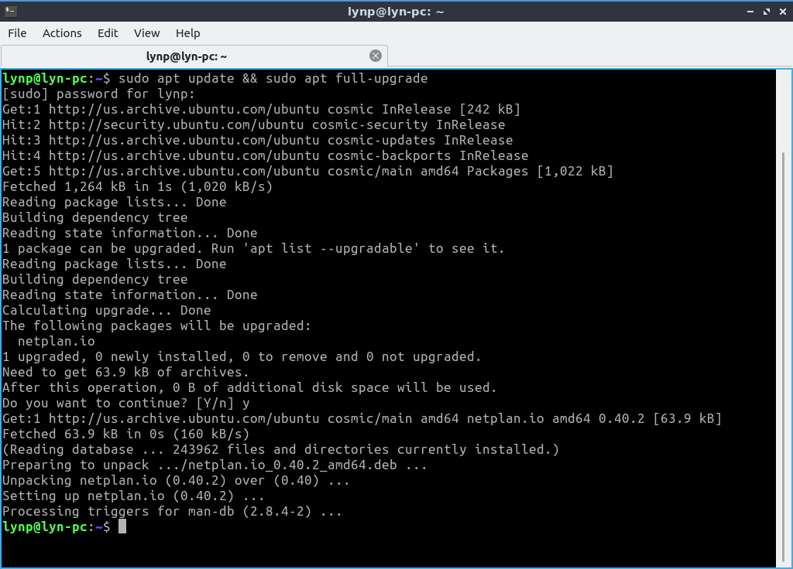
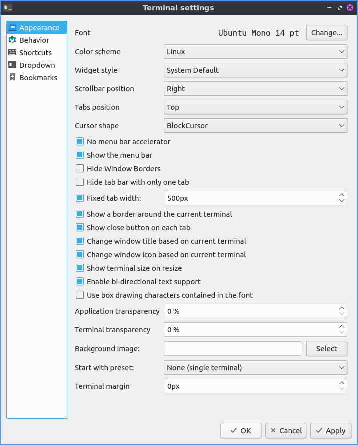

Chapter 3.1.3 qterminal
=======================

qterminal is the default terminal of Lubuntu that also has a drop down version.

Useage
------
To open a new tab go to the :menuselection:`file --> New Tab` or press :kbd:`control + shift + t`. To close a tab press the X button near the right hand side of the tab. You can change between tabs by left clicking on the tabbar on the tab you want to switch to. If you want to switch between tabs click on the different click on that tab or press the left and right arrows in the upper right corner on the tabbar. Another way to switch between tabs is :kbd:`control + page up` or :kbd:`control + page down`. If you want to copy text from the temrinal press :kbd:`control +  shift + c`  or :menuselection:`Edit --> Copy selection` to copy text. If you wish to paste text into the terminal you can :kbd:`control + shift + v` or :menuselection:`Edit --> Paste Clipboard` however you should be really careful it is not a malicious command and shows the command you are pasting in. If you want to paste selected text in the terminal press :kbd:`Shift + Insert` or :menuselection:`Edit --> Paste Selection`. If you want to open a new terminal window :kbd:`Control+ Shift+ N` or go :menuselection:`File --> New Window`. To try to autocomplete the command you type in a command line press the :kbd:`Tab` key.   

If you get a url in your terminal you can right click copy link address to copy the link. To open your link directly press :kbd:`Control + left click`. To zoom in on the terminal press :kbd:`Control + Shift + +` or right click and select :`Zoom in`. To zoom out press :kbd:`Control + -` or right click :menuselection:`Zoom out`. To return to the original zoom press :kbd:`Control + 0` or right click original zoom. If you want qterminal to be fullscreen press :kbd:`F11` to make it fullscreen then :kbd:`F11` again to make it back to its original size.

To split your terminal vertically into two terminals on top of each other :menuselection:`Actions --> Split Terminal Horizontal`. To have one terminal to the left and one to the right :menuselection:`Actions --> Split Terminal Vertically`. To collpase back to how your terminal back to how they were before :menuselection:`Actions --> Collapse Subterminal`. To switch between the two split terminals click on the terminal you want. To switch to a the lower split terminal press :kbd:`Alt + Down` or :menuselection:`Actions --> Bottom Subterminal`. To switch the the top subterminal press :kbd:`Alt + Up` or :menuselection:`Actions --> Top Subterminal`. To switch to the left subterminal press :kbd:`Alt +Left` or :menuselection:`Actions --> Left Subterminal`. To switch to the right subterminal press :kbd:`Alt +Right` or :menuselection:`Actions --> Right Subterminal`.

To change to the next tab using the keyboard press :kbd:`Control + Page Down` or :menuselection:`Actions --> Next tab`. To change to the previous tab using the keyobard press :kbd:`Control+ Page up` or :menuselection:`Actions --> Previous Tab`. To move to a tab to the right :menuselection:`Actions --> Move tab to the right`. To move a tab to the left :menuselection:`Actions --> Move tab to the left`.

To clear you active terminal press :kbd:`Control + Shift +X` or :menuselection:`Actions --> Clear Active Terminal`. To hide window borders check the :menuselection:`View --> Hide Window borders`.

Customizing
-----------

To change your preferences go to :menuselection:`File --> Preferences`. To change your font press the :guilabel:`Change` button next to the :guilabel:`font` label. The :guilabel:`Color scheme` field lets you say change how different colored things in the terminal colors appear. The :guilabel:`Widget style` lets you overwrite the system widget style with something other than system default. The :guilabel:`Scrollbar position` lets you move the scrollbar to the left or right or remove it entirely. The :guilabel:`Tabs position` moves the bar to that part of the window of qterminal. The :guilabel:`Keyboard cursor shape`changes the shape of the cursor between block cursor a large block, underline cursor a small underline, or  IBeamCursor which is quite small like a | character. 

To toggle showing the menubar check/uncheck the :guilabel:`Show the menubar` checkbox. The checkbox :guilabel:`Hide tab bar with only one tab` hides the tab bar when you only have one tab. The checkbox :guilabel:`Limit tab width` limits how wide a tab would be how be and the filed next to it is how wide to limit the width of tabs.The :guilabel:`Show a border around the current terminal` shows a border around the terminal. The checkbox :guilabel:`Show terminal size on resize` toggles showing the terminal size on resizing the window. To have support for languages with both right to left and left to right text check the :guilabel:`Enable bi-directional text support`. 

The field :guilabel:`Application transparency` gives you the percent transparent for the full application transparency. The feild :guilabel:`Terminal transparency` is how transparent to make the terminal. Note you will need to enable the compton compositor for this function properly. To select a background image for your terminal press the :guilabel:`Select` button next to :guilabel:`Background image:`. The field :guilabel:`Start with preset` lets you choose how many terminal splits to have when you start up qterminal.

To apply these changes to see how they appear on qterminal press the :guilabel:`Apply` button. If you like your new customized terminal layout press the :guilabel:`OK` button or if you wish to cancel your changes press the :guilabel:`Cancel` button. 

The :guilabel:`Behavior` tab changes history, pasting, and different kinds of emulation. The button for unlimited history will save an unlimited amount of history. The history size in line lets you save only that many lines of history. The checkbox for :guilabel:`Confirm multiline paste` brings up a confirmation for pasting multiple lines. The checkbox :guilabel:`Trim trailing newlines in pasted text` removes excess newlines in pasting text from the end of what you paste. The :guilabel:`Ask for confirmation when closing` pops up a confirmation dialog when you close qterminal. The checkbox :guilabel:`Save position when closing` saves the position when closing qterminal. The :guilabel:`Open new terminals in current working directory` checkbox open new terminals in the last working directory you were on.

The :guilabel:`Shortcuts` tab shows all the different shortcuts and how to change keyboard shortcuts. The :guilabel:`Shortcut` column shows what the keyboard shortcut does. The :guilabel:`Key` column is the keyboard shortcut to launch the shortcut. To change or add a keyboard shortcut double click under the :guilabel:`Key` column and then press the keyboard shortcut you want.

The :guilabel:`Dropdown` tab shows effects on the appearance for the drop down settings of qterminal. The :guilabel:`Show on start` checkbox shows the drop down terminal if checked and if unchecked it will be hidden at the start. The :guilabel:`Height` field shows the height of the drop down terminal. The :guilabel:`Width` field shows how wide to make the dropdown terminal. The field :guilabel:`Shortcut` is the shortcut to bring down the drop down terminal and to change the shortcut type in a different key. 

Version
-------
Lubuntu ships with version 0.9.0 of qterminal.

How to launch
-------------
To launch qterminal in a normal window go to the menu :menuselection:`System Tools --> QTerminal` or run 

.. code:: 

   qterminal 

from the command line. To launch a drop down version of Qterminal from the menu :menuselection:`System Tools --> QTerminal drop down`  or run 

.. code:: 

   qterminal -d 

from the command line.
