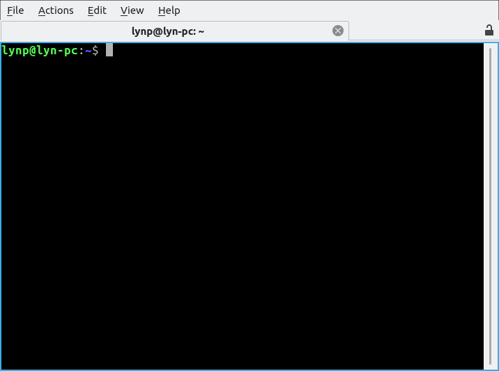
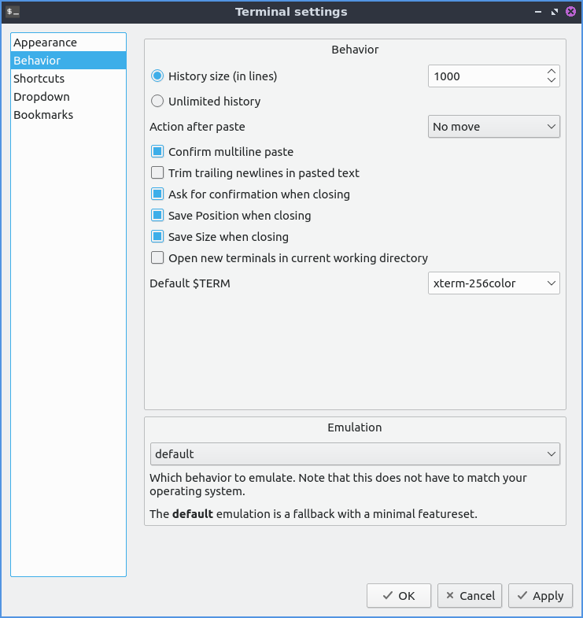
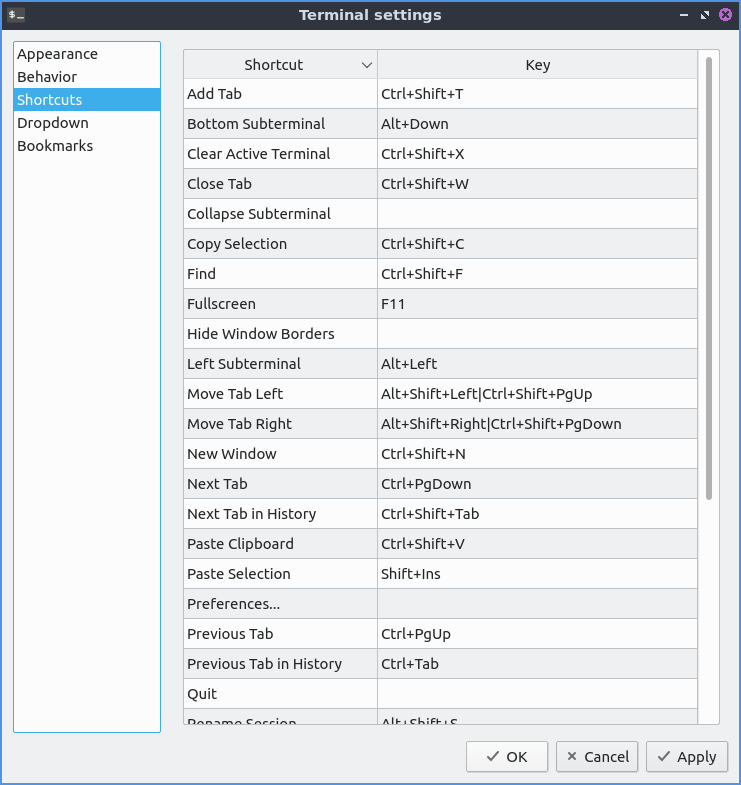
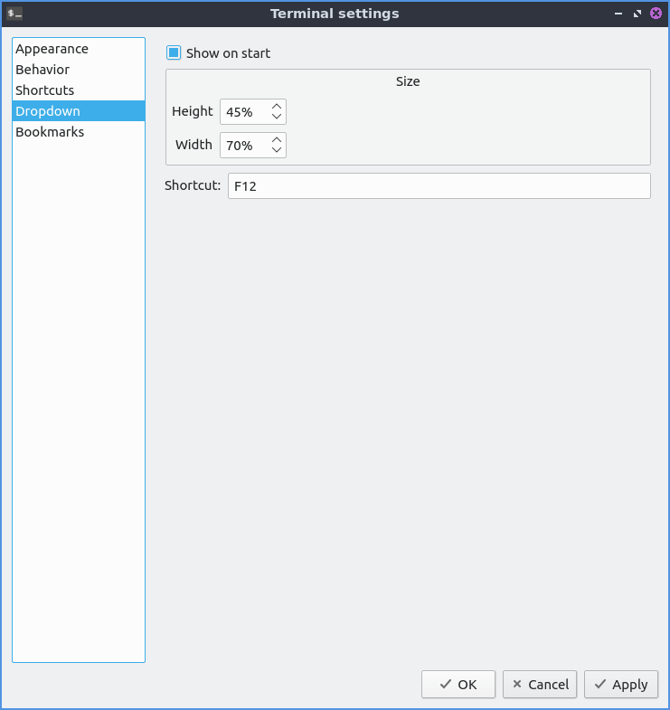

Chapter 3.1.3 QTerminal
=======================

QTerminal is the default terminal of Lubuntu that also has a drop down version. If you want to learn more about the actual commands you run in the terminal see `Appendix C <https://manual.lubuntu.me/C/command_line.html>`_

Usage
------
To open a new tab go to the :menuselection:`File --> New Tab` or press :kbd:`control + shift + t`. You can also open a new tab by double click to the right of all tabs to open a new tab. To close a tab press the X button near the right hand side of the tab or press :kbd:`Control+Shift+W`. You can change between tabs by left clicking on the tabbar on the tab you want to switch to. If you want to switch between tabs click on the different click on that tab or press the left and right arrows in the upper right corner on the tabbar. Another way to switch between tabs is :kbd:`control + page up` or :kbd:`control + page down`. If you want to copy text from the terminal press :kbd:`control +  shift + c`  or :menuselection:`Edit --> Copy selection` to copy text. If you wish to paste text into the terminal you can :kbd:`control + shift + v` or :menuselection:`Edit --> Paste Clipboard` however you should be really careful it is not a malicious command and shows the command you are pasting in. If you want to paste selected text in the terminal press :kbd:`Shift + Insert` or :menuselection:`Edit --> Paste Selection`. If you want to open a new terminal window :kbd:`Control+ Shift+ N` or go :menuselection:`File --> New Window`. To try to autocomplete the command you type in a command line press the :kbd:`Tab` key.   

.. image:: qterminal.png

If you get a url in your terminal you can right click :menuselection:`Copy Link Address` to copy the link. To open your link directly press :kbd:`Control + left click` or right click the link and select :menuselection:`Open Link`. To zoom in on the terminal press :kbd:`Control + Shift + +` or right click and select :menuselection:`Zoom in`. To zoom out press :kbd:`Control + -` or right click :menuselection:`Zoom out`. To return to the original zoom press :kbd:`Control + 0` or right click :menuselection:`Zoom reset`. If you want qterminal to be fullscreen press :kbd:`F11` or :menuselection:`View --> Fullscreen` to make it fullscreen then :kbd:`F11` or :menuselection:`View --> Fullscreen` again to make it back to its original size.

To scroll upward in qterminal scroll upwards with the mousewheel and you can see the results of previous commands you have run. To scroll downward scroll downward on the mouswheel. To go all the way back to the bottom start typing and it will focus on the bottom.

To split your terminal vertically into two terminals on top of each other :menuselection:`Actions --> Split Terminal Horizontal`. To have one  split terminal to the left and one to the right :menuselection:`Actions --> Split Terminal Vertically`. To collapse back to how your terminal back to how they were before :menuselection:`Actions --> Collapse Subterminal`. To switch between the two split terminals click on the terminal you want. To switch to the lower split terminal press :kbd:`Alt + Down` or :menuselection:`Actions --> Bottom Subterminal`. To switch the top subterminal press :kbd:`Alt + Up` or :menuselection:`Actions --> Top Subterminal`. To switch to the left subterminal press :kbd:`Alt +Left` or :menuselection:`Actions --> Left Subterminal`. To switch to the right subterminal press :kbd:`Alt +Right` or :menuselection:`Actions --> Right Subterminal`. To move to the tab you had before :menuselection:`Actions --> Previous Tab in History`. To move to the next tab before that :menuselection:`Actions --> Next Tab in History`.

To change to the next tab using the keyboard press :kbd:`Control + Page Down` or :menuselection:`Actions --> Next tab`. To change to the previous tab using the keyboard press :kbd:`Control+ Page up` or :menuselection:`Actions --> Previous Tab`. To move to a tab to the right :menuselection:`Actions --> Move tab to the right`. To move a tab to the left :menuselection:`Actions --> Move tab to the left`.

To bring a search for the text displayed on your terminal press :kbd:`Control +Shift +F` or :menuselection:`Actions --> Find...`. To close the search bar press :kbd:`Escape` or :kbd:`Control+Shift+F` again. To find what you need to search for in the :guilabel:`Find` search bar. To move to the next result press the rightward pointing arrow button. To move to the previous result is to press the leftward pointing arrow. To change to not to match case press the downward pointing arrow button uncheck the :guilabel:`Match Case` checkbox. To toggle highlighting all matches check/uncheck the :guilabel:`Highlight all matches` checkbox. To use a regular expression click the downard pointing arrow button and check the :guilabel:`Regular expression` checkbox. 

To clear you active terminal press :kbd:`Control + Shift +X` or :menuselection:`Actions --> Clear Active Terminal`. To hide window borders check the :menuselection:`View --> Hide Window borders`. To toggle showing the entire menubar press :kbd:`Control+Shift+M` or right click on the :menuselection:`Toggle Menu` then do the same thing to get the menu back again. To toggle showing the tab bar :menuselection:`View --> Show Tab Bar`. To change which side of the terminal the tab bar is :menuselection:`View --> Tabs Layout`.

To use the drop down function of QTerminal once launched press :kbd:`F12` to have the terminal drop down or roll up.

To rename a tab press :kbd:`Alt+Shift+S` or right click on the tab bar and select :menuselection:`Rename session` and then press the :guilabel:`OK` button in the popup. To change the color of the tab :menuselection:`Change title color` menuselection.

Customizing
-----------

To change your preferences go to :menuselection:`File --> Preferences` or right click the terminal and :menuselection:`Preferences`. To change your font press the :guilabel:`Change` button next to the :guilabel:`font` label and a dialog will show up. To change the font size enter it in the :guilabel:`Size` field. The terminal works best with monospaced fonts which often have mono somewhere in their name. To change your font use the :guilabel:`Font` drop down.

.. image:: qterminal-font.png

 The :guilabel:`Color scheme` field lets you say change how different colored things in the terminal colors appear. The :guilabel:`Widget style` lets you overwrite the system widget style with something other than system default. The :guilabel:`Scrollbar position` lets you move the scrollbar to the left or right or remove it entirely. The :guilabel:`Tabs position` moves the bar to that part of the window of qterminal. The :guilabel:`Cursor shape` changes the shape of the cursor between block cursor a large block, underline cursor a small underline, or  IBeamCursor which is quite small like a | character. 

To toggle showing the menubar check/uncheck the :guilabel:`Show the menubar` checkbox. The checkbox :guilabel:`Hide tab bar with only one tab` hides the tab bar when you only have one tab. The checkbox :guilabel:`Limit tab width` limits how wide a tab would be how be and the filed next to it is how wide to limit the width of tabs. The :guilabel:`Show a border around the current terminal` shows a border around the terminal. The checkbox :guilabel:`Show terminal size on resize` toggles showing the terminal size on resizing the window. To have support for languages with both right to left and left to right text check the :guilabel:`Enable bi-directional text support`. 

.. image:: qterminalprefrences.png 

The field :guilabel:`Application transparency` gives you the percent transparent for the full application transparency. The field :guilabel:`Terminal transparency` is how transparent to make the terminal. Note you will need to enable the compton compositor for this function properly. To select a background image for your terminal press the :guilabel:`Select` button next to :guilabel:`Background image:`. The field :guilabel:`Start with preset` lets you choose how many terminal splits to have when you start up QTerminal.To have a margin on the left side of the terminal set the :guilabel:`Terminal margin` will show the marginal in the terminal in pixels.

To apply these changes to see how they appear on QTerminal press the :guilabel:`Apply` button. If you like your new customized terminal layout press the :guilabel:`OK` button or if you wish to cancel your changes press the :guilabel:`Cancel` button. 

The :guilabel:`Behavior` tab changes history, pasting, and different kinds of emulation. The button for :guilabel:`Unlimited history` will save an unlimited amount of history. The :guilabel:`History size (in lines)` lets you save only that many lines of history. The checkbox for :guilabel:`Confirm multiline paste` brings up a confirmation for pasting multiple lines. The checkbox :guilabel:`Trim trailing newlines in pasted text` removes excess newlines in pasting text from the end of what you paste. The :guilabel:`Ask for confirmation when closing` pops up a confirmation dialog when you close qterminal. The checkbox :guilabel:`Save position when closing` saves the position when closing qterminal. The :guilabel:`Open new terminals in current working directory` checkbox open new terminals in the last working directory you were on.

The :guilabel:`Shortcuts` tab shows all the different shortcuts and how to change keyboard shortcuts. The :guilabel:`Shortcut` column shows what the keyboard shortcut does. The :guilabel:`Key` column is the keyboard shortcut to launch the shortcut. To change or add a keyboard shortcut double click under the :guilabel:`Key` column and then press the keyboard shortcut you want. To change how you sort your keyboard shortcuts left click on the column to sort in a different order.

The :guilabel:`Dropdown` tab shows effects on the appearance for the drop down settings of qterminal. The :guilabel:`Show on start` checkbox shows the drop down terminal if checked and if unchecked it will be hidden at the start. The :guilabel:`Height` field shows the height of the drop down terminal. The :guilabel:`Width` field shows how wide to make the dropdown terminal. The field :guilabel:`Shortcut` is the shortcut to bring down the drop down terminal and to change the shortcut type in a different key. 

The :guilabel:`Bookmark` tab has settings for a sidebar to quickly change directories in the terminal. To enable this sidebar check the :guilabel:`Enable bookmarks` checkbox.

Version
-------
Lubuntu ships with version 0.14.1 of QTerminal.

How to launch
-------------
To launch QTerminal in a normal window go to the menu :menuselection:`System Tools --> QTerminal` or run 

.. code:: 

   qterminal 

from the command line. To launch a drop down version of QTerminal from the menu :menuselection:`System Tools --> QTerminal drop down`  or run 

.. code:: 

   qterminal -d 

from the command line. You can also launch QTerminal by pressing the keyboard shortcut :kbd:`Control+Alt+T`.
