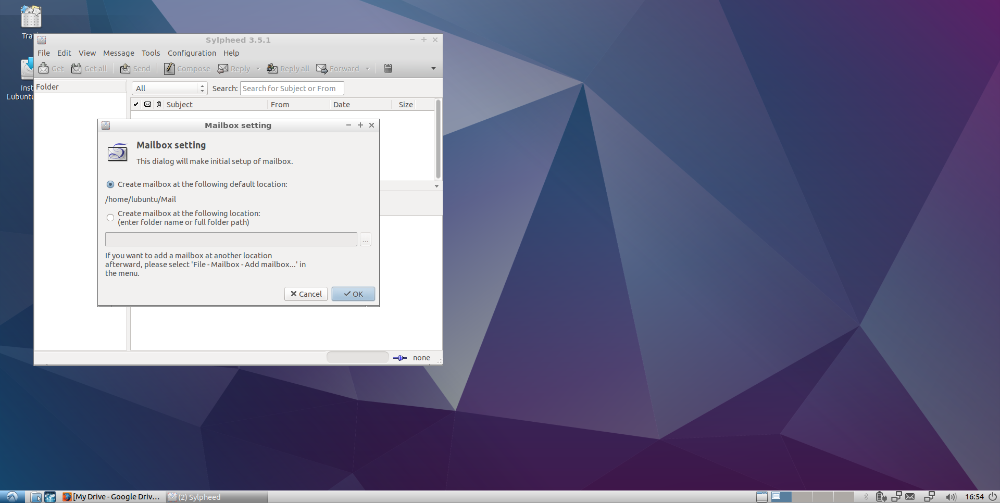

Chapter 3.1.3: Sylpheed
==============================

Description
---------------
Sylpheed is a simple, lightweight but featureful, and easy-to-use e-mail client.

Sylpheed has the following features, plus more:
 - Security features (GnuPG, SSL/TLSv1)
 - Extensive plugins
 - Junk mail control
 - Multilingualiztion
 - Filtering and search

Usage/Screenshots
----------------------

Version
----------
Lubuntu currently ships with Sylpheed 3.5.1.

How to launch
----------------
To open Sylpheed, click on the Sylpheed icon (mail icon  with a blue "s") in the Lubuntu Menu.
You can also type and run `sylpheed` in the terminal to open it.