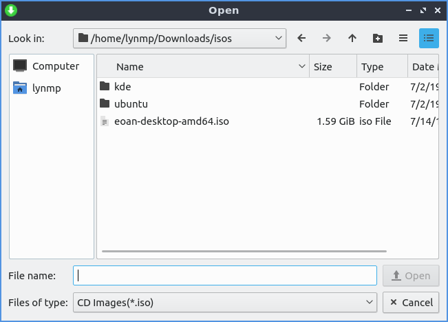
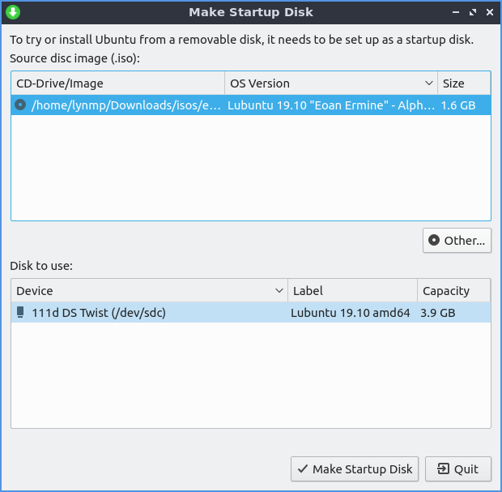

Chapter 3.1.4 Startup Disk Creator
==================================

Startup Disk creator is a graphical utility for creating bootable USB media.

Version
-------
Lubuntu ships version 0.3.5 of Startup Disk Creator.

Usage
------
To see what USB devices you can make into startup disks are listed under the :guilabel:`Disk to use` heading on the screen. To see what the device is named look under the :guilabel:`Device` column. To change what the device is labeled is under the :guilabel:`Label` column. To see the max size of the usb drive is under the :guilabel:`Capacity` column.

.. warning:: 
  The processs of creating a startup disk to boot off deletes all data on the disk but only shows usb devices if you hard usb hard drives or flash drives with data you want to keep it is recoommended to unplug these devices so there is no way of accidentaly deleting data you care about.

If you want to find an iso image if it is not shown press the :guilabel:`Other` button and a file dialog to open the location will show up. To open the iso left click on the iso and press the :guilabel:`Open` button.

To actually create the disk press the :guilabel:`Make Startup Disk` button. A dialog will appear asking if you want to write the disk image and all data will be lost to make the disk press the :guilabel:`Yes` button. Another dialog box will show up asking for your to enter your password to make sure it is you making this disk and then the image will be written with a progress bar. Once done you will get a dialog saying :guilabel:`The installation is complete` and an :guilabel:`OK` button.

How to Launch
-------------
To launch startup disc creator :menuselection:`System Tools --> Startup disk creator` or run 

.. code::

  usb-creator-kde

from the command line.
