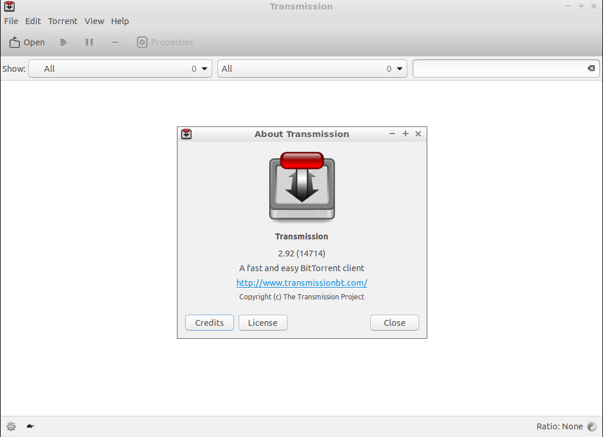

Chapter 3.3.4: Leafpad
==============================

Description
---------------
Transmission is a BitTorrent client which features a variety of user interfaces on top of a cross-platform back-end.

It is a fully open-source, non-freemium client doesn't bundle toolbars, pop-up ads, flash ads, twitter tools or track users.

Currently, Transmission has the following features:
 - Uses fewer resources than other clients
 - Native Mac, GTK+ and Qt GUI clients
 - Daemon ideal for servers, embedded systems, and headless use
 - All these can be remote controlled by Web and Terminal clients
 - Local Peer Discovery
 - Full encryption, DHT, µTP, PEX and Magnet Link support

Usage/Screenshots
----------------------

Version
----------
Lubuntu currently ships with Transmission v2.93.

How to launch
----------------
Go to the Applications Menu > Internet > Transmission