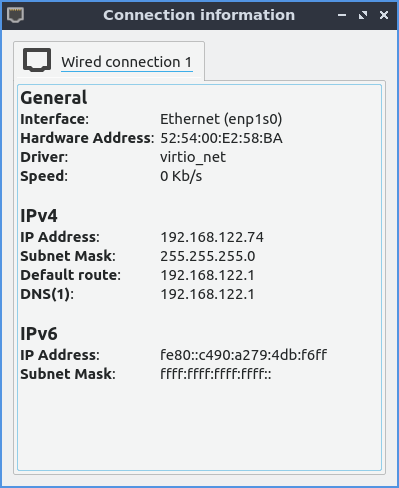
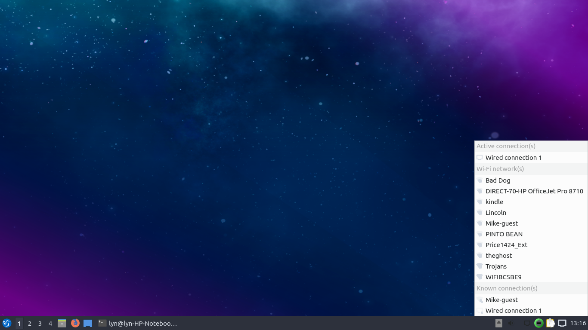

Chapter 3.1.5 nm-tray
=====================

nm-tray is the applet to manage network connections. 

Usage
------
If you want to connect to  a network on nm-tray left click the icon in the system tray. If you have a wired connection with DHCP it should connect automatically. If you want to disconnect your from a network under active connections left click to disconnect. To connect to wifi left click on the nm-tray applet and connect the wifi name applet and then enter the password for the wifi.  
After connecting to a wifi your known connections will by left clicking on nm-tray of wifi connections under known connections. The list of active connections are networks you are currently connected to. The list of wifi networks is listed under wifi networks you are connected to.  

To toggle notifications on connecting and disconnecting to networks right click on the nm-tray tray icon and check or uncheck the checkbox for :guilabel:`Enable notifications`. To disable wifi uncheck :guilabel:`Enable Wifi`. To turn off all networking uncheck :guilabel:`Enable Networking`. To bring up more options to edit your connection right click the nm-tray icon and select :guilabel:`Edit connections`.

To view your own networking information right click the applet :menuselection:`Connection Information` which will pop up a window with information such as your ip address. On this window each interface will show the names of each network interface in a tab bar along the top. The field :guilabel:`Interface` Shows you the name of your network adapter to the system what type of connection it is. The label for :guilabel:`Driver` shows you what driver is in use for this network interface. The field :guilabel:`Speed` shows the speed supported by the connection. 

The section :guilabel:`IPV4` shows you information on your settings for networking using IPV4. The section :guilabel:`IP Address` shows you  your current ip address. The :guilabel:`DNS` fields show where your dns looks up the domain names of websites and finds them. 

Screenshot
----------

Version
-------
Lubuntu ships with version 0.4.1 of nm-tray.

How to launch
-------------
nm-tray should automatically launch in the system tray to and looks like either a plug with a cable plugged in if you have an ethernet connection. 
