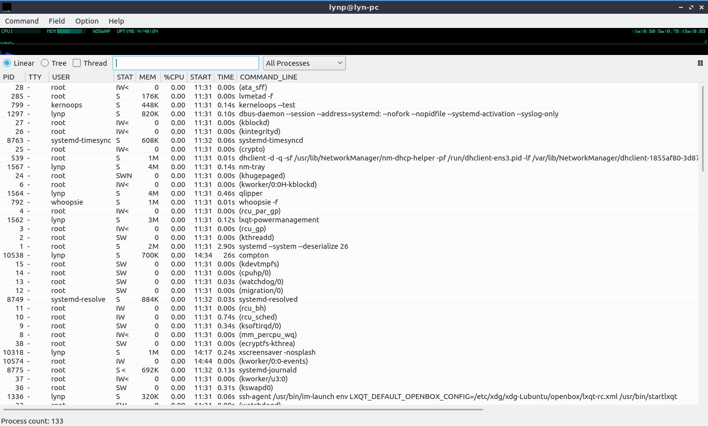
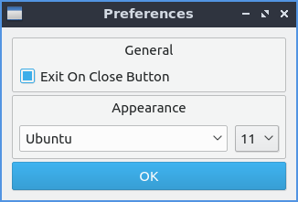

Chapter 3.1.6 qps
=================

qps is the graphical task manager included with Lubuntu. It is useful to close non-responsive programs.

Usage
------
To see your memory usage in qps look at the bar that says :guilabel:`MEM`. The bar for :guilabel:`CPU` usage shows CPU usage with a bar graph with usage with a bar graph for CPU usage. The :guilabel:`Uptime` in the top bar shows how long your computer has been running. A blue bar showing file input output shows graph in blue. Above this there is a green graph that shows your CPU usage as a graph. To show when a program was started with the :guilabel:`START` column. To have a view of process ID of each process use the :guilabel:`PID` column. The column :guilabel:`Command Line` shows what command line starts the process. To show which user the process is running on is in the :guilabel:`USER` column. 

To sort your processes by memory click on the mem tab. To have your processes sorted by CPU percentage press the button :guilabel:`CPU%` To have your processes sorted by CPU%.  To sort by the command line of each process you can press the command line. To sort by how much memory is used by each process click on the :guilabel:`Mem` tab. To only show processes by your user on the toolbar 
drop down  and select :menuselection:`Your Processes`. To view only processes not run by the root user form the dop menu on lower toolbar select :menuselection:`Non-Root Processes`. To view only running processes select on the drop down menu on the lower toolbar select :menuselection:`Running Processes`. To go back to viewing all processes select from the drop down menu on the toolbar select :menuselection:`All Processes`.

To change your process view to each process gets its own line or linear select the :guilabel:`Linear` radio button in the upper left hand corner. To organize each related process with a tree for parent and child processes press the :guilabel:`Tree` radio button. To search for a particular process enter a search term in the bar towards the center top of the user interface.

When you have qps open a tray icon will appear that shows a graph of cpu usage. If you right click :menuselection:`Hide` to make qps not show in the taskbar. To bring qps back to the front off all windows right click on the tray icon :menuselection:`Show`. To quit qps press :kbd:`Alt +Q` or right click the tray icon and select :menuselection:`Quit`.

To search for a particular process you can type your type into the search bar right above a particular process right above it. To terminate a process right click on it and select :menuselection:`Terminate` or press :kbd:`delete`. To kill a process move the mouse over it right click and select :menuselection:`Kill` or press :kbd:`Alt + K`.    

To toggle showing a graph with your overall system usage check/uncheck the :menuselection:`Otion --> Show Graph` checkbox in the menu. To toggle showing the bar with the option to search for processor or choose linear or tree view of processes check/uncheck :menuselection:`Option -->  Show Control bar` checkbox in the menu. To change the update period is to :menuselection:`Option --> Update Period`. Then input your update period in the :guilabel:`New Update Period` field.

Version
-------
Lubuntu ships with version 1.10.20 of qps. 

Screenshot
----------

How to launch
-------------
To launch qps go to the menu :menuselection:`System Tools --> qps` or run 

.. code:: 

   qps 
   
from the command line. 

Customizing
------------
 To change more preferences :menuselection:`Options --> Prefrences` and a preferences window will pop up. To change the font is the drop down menu under :guilabel:`Appearance` and the drop down number is for the font size. To change how CPU usage is divided per your total number of CPU cores or a Single CPU press a radio button under :guilabel:`%CPU divided by`. 

