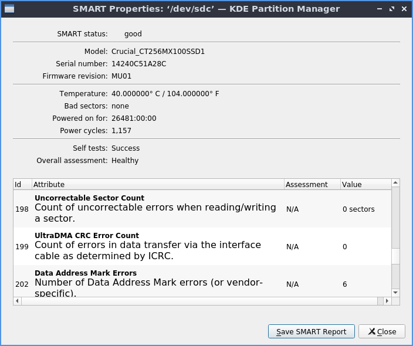
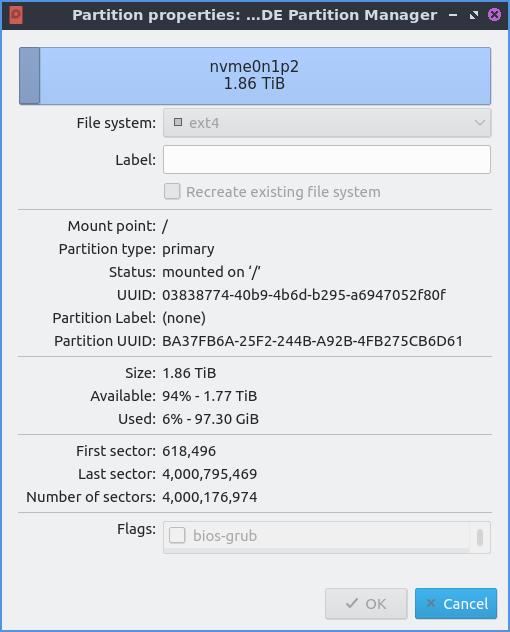
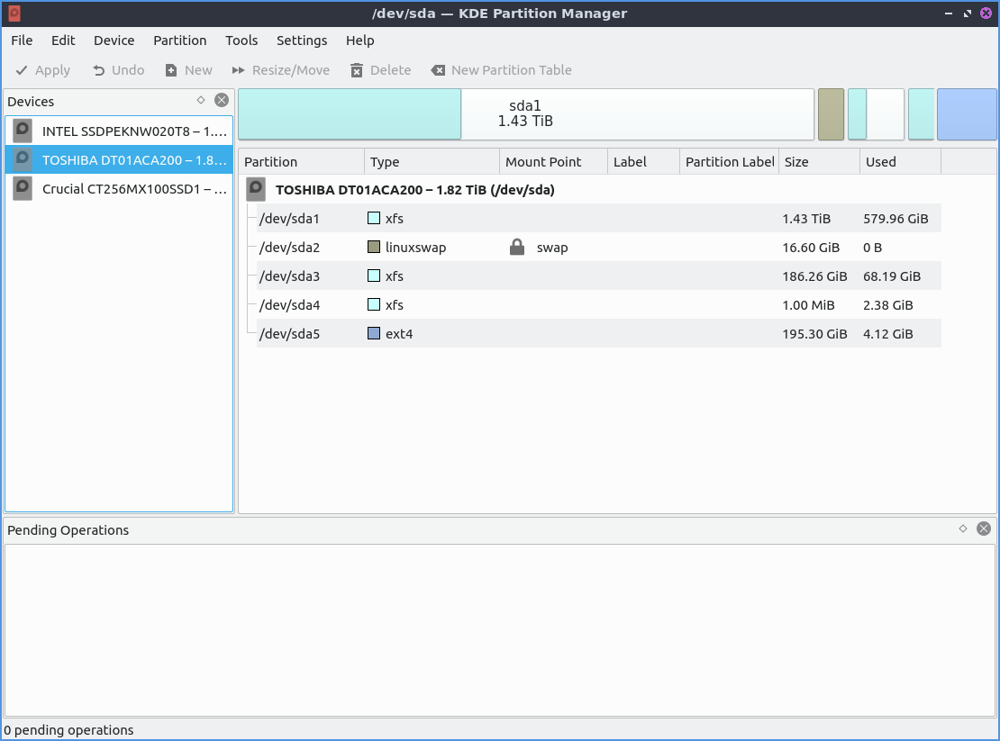
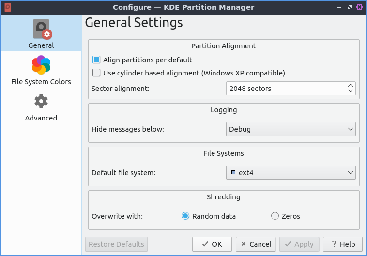
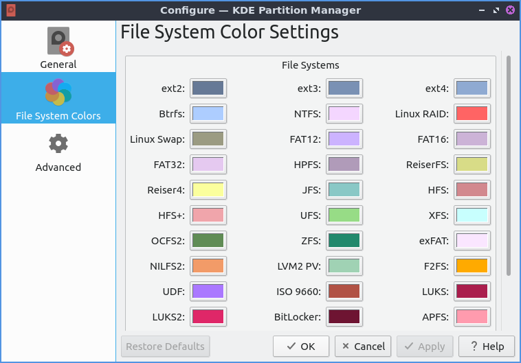

Chapter 3.1.7 KDE Partition Manager
===================================

KDE partition manager creates partitions and deletes partitions on your hard drives and solid state drives.

.. warning::

 Deleting and creating new partitions can result in data loss so please back up your data before removing or creating partitions.

Usage
------

To check the health of your hard drive or solid state drive on the :menuselection:`Device --> SMART Status` or by right clicking on the device in the side pane :menuselection:`Smart Status`. The field :guilabel:`SMART status` shows the overall health of your drive or if it has detected any problems. The field :guilabel:`Model` shows the model number of your particular drive. The field :guilabel:`Temperture` shows the temperature of your drive but it is bad for it to be too hot. The field :guilabel:`Bad sectors` show how many sectors on your drive are no longer functioning. The field :guilabel:`Powered on for` shows how long your drive has been powered on. To see how many times your machine has rebooted with the drive look at the :guilabel:`Power cycles` field. The :guilabel:`Self tests field` is for if the drive has completed its self tests. The field :guilabel:`Overall assessment` shows your overall status of the drive.

Below is having a list of the raw values of smart on the drive some of which can be vendor specific or depend on each drive. One important one on spinning discs is to realize if the :guilabel:`Reallocated Sectors Count`  which if nonzero likely means imminent drive failure. 

You can see your disk usage for each partition graphically with the bars at the top with the shaded in part showing a bar graph as the percentage full of the partition and you can select each partition by left clicking on that section of the bar graph. The Column :guilabel:`Size` shows the size of the entire system while the :guilabel:`Used` column shows the amount of space used on the drive. The :guilabel:`Type` column lets you see which filesystem is on the partition. The :guilabel:`Mount Point` column shows where that partition is mounted.

On the side pane to the left you can switch between each different drive on the left with the name of each device. Another way to switch which device you are managing partitions on use :menuselection:`Device --> Select Current Device`.

To delete a partition left click on a partition to select it press :kbd:`Delete`, :menuselection:`Partition --> Delete`,  or right click and select :menuselection:`Delete`. To add a new partition in unallocated space right click on the   To view statistical information on a partition select the partition :menuselection:`Partition --> Properties`  or right click on that partition :menuselection:`Properites`. To resize or move a partition press :kbd:`Control+R`, :menuselection:`Partition --> Resize/Move`, or right click on the partition and select :menuselection:`Resize/Move`. On the bottom of the window a list of :guilabel:`Pending Operations` to be applied to your drives. If you want to delete a partition on a hard drive and overwrite the data on that partition :menuselection:`Partition --> Shred` or  :kbd:`Shift+Delete`. However shredding solid state drives is not recommended as it may not fully scrub the data and may marginally wear out your drive. 

To change your partitions you will need to apply your changes later press the :guilabel:`Apply` button or :menuselection:`Edit --> Apply`. After pressing Apply a dialog will come up asking you to confirm and check this is what you want to do and then press :guilabel:`Apply Pending Operations` to apply these changes. To go back from this point press the :guilabel:`Cancel` button. To undo your your changes to your partitions press :kbd:`Control+Z`, the :guilabel:`Undo` button, or :menuselection:`Edit --> Undo`. To clear your operations that have yet to been applied :menuselection:`Edit --> Clear`.

If you have say a new solid state drive that is not formatted you first need to put a partition table on it. A new partition data will get rid of all partitions on the disk which means no data will be visible anymore. Then you will need to create a partition on to store data. On unallocated space you can right click on the unallocated space press the :guilabel:`New` button, :menuselection:`Partition --> New`, or press :kbd:`control+N`. A window will popup saying with what type of settings to create the partition with. To change what filesystem you want to create will show in the :guilabel:`File system:` drop down menu. To change what size of partition you want to create change the :guilabel:`Size:` field. To create free space before the partition change the :guilabel:`Free space before:` field. To change free space after the partition change the :guilabel:`Free space after` field. To actually create the partition press the :guilabel:`OK` button while to cancel press the :guilabel:`Cancel` button.

To view information of a partition on your drive double click on it. On the top a bar code on the top shows how full the parition is. To see what kind of file system it is in the :guilabel:`File system` field. To see a label on your filesystem look at the :guilabel:`Label` field. To see where that partition is mounted is in the :guilabel:`Mount point` field. To see what partition type you use in the :guilabel:`Partition type` field. To see the size of the parition is in the :guilabel:`Size` field. To see the available size read the :guilabel:`Avialalbe` field.

If you have multiple drives on your system :menuselection:`Device --> Select Current Device --> Desired Disk`. To view information on the current drive such as what type of partition table or Logical size and smart status :menuselection:`Device --> Properties`. If you do not really see all your devices or current status press :kbd:`F5` or :menuselection:`Tools --> Refresh Devices`.

If you want to quit KDE Partition manager press :kbd:`Control+Q`.

Screenshot
-----------

Version
-------
Lubuntu ships with version 3.3.1 of partition manager.

How to launch
-------------
To launch KDE Partition Manager from the :menuselection:`System Tools --> KDE Partition Manager` or run 

.. code:: 

   partitionmanager 
   
from the command line. 

Customizing
-----------
To toggle showing a statusbar that shows pending operations check/uncheck the :menuselection:`Settings --> Show Statusbar` checkbox in the menu. To toggle showing your devices side pane check/uncheck the :menuselection:`Settings --> Panels Shown --> Devices`. To toggle showing information about the currently selected partition check/uncheck the :menuselection:`Settings --> Panels Shown --> Infromation` checkbox in the menu.  To toggle showing log output of check/uncheck the :menuselection:`Settings --> Panels Show --> Log Output` checkbox. 

To customize settings for KDE Partition Manager press :kbd:`Control+Shift+,` or :menuselection:`Settings --> Configure KDE Partition Manager`. The :guilabel:`General` tab has settings for aligning partitions and defaults for partitions. To change where your sectors on your disc align to use the :guilabel:`Sector alignment` field. To change which messages to log you can change with :guilabel:`Hide messages below`  to hide lower level messages to be logged. To choose your default file system use the :guilabel:`Default file system` drop down menu. To change whether to overwrite shredded data with zeros or random data use the buttons to the right of :guilabel:`Overwrite with` group of buttons.

To change the different colors of filesystem as they appear use the :guilabel:`File System Colors` tab. To change the colors of each filesystem in the top bar and other things left click on the button next to the filesystem name. 

