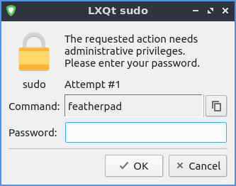

Chapter 3.1.8 LXQt sudo
=======================

LXQt-sudo is a way to launch graphical applications with administrative privileges.

Usage
------
LXQt-sudo is used to open graphical programs as an administrator. 

.. warning::

 Modifying the wrong system configuration files with adminstrator privileges could make your system unable to boot or for you to be unable to login.

To use lxqt-sudo is important to not change your config files as if you did with sudo. You will need administrative privileges to edit config files but make sure you know what you are doing. To actually use LXQt sudo you will need to type your password into the :guilabel:`Password` field and then press the :guilabel:`OK` button.

Version
-------
Lubuntu ships with 0.14.1 of lxqt-sudo. 

Screenshot
----------

How to Launch
-------------
To launch lxqt-sudo from the command line to run featherpad with administrative privileges use 

.. code::

   lxqt-sudo featherpad

You can also run lxqt-sudo from the runner for example type in

.. code:: 

   lxqt-sudo pcmanfm-qt 

into the runner to do it this way without opening a terminal.
