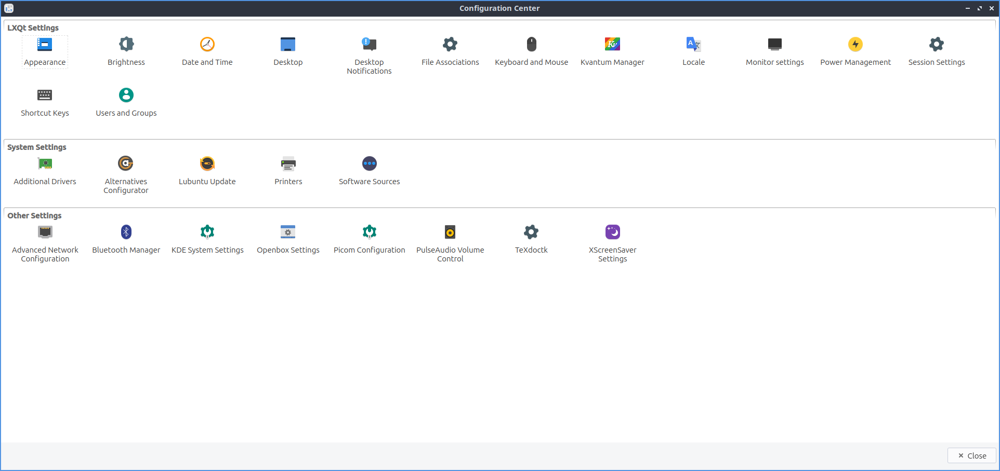

Chapter 3.2.1 LXQt Configuration Center
=======================================

LXQt Configuration Center is the default "control center" application with buttons that launches configuration options for LXQt the default desktop environment of Lubuntu. 

Usage
------
LXQt configuration center lets you launch many different applications in this chapter from a simple control center where you can double click on the icon for that program. To close one of the programs here you have launched you can close it by pressing :kbd:`Escape` or press the :guilabel:`Close` button. Another way to select programs is move the currently selected item with the arrow keys on your keyboard and you can launch a program by pressing :kbd:`Enter`.

Screenshot
----------

Version
-------
Lubuntu ships with version 0.14.1 of LXQt Configuration Center.

How to Launch
-------------

To launch LXQt Configuration Center from the menu :menuselection:`Preferences --> LXQt settings --> LXQt Configuration Center` or run

.. code:: 

   lxqt-config 
   
from the command line. The icon for LXQt Configuration Center is two interlocked gears.
