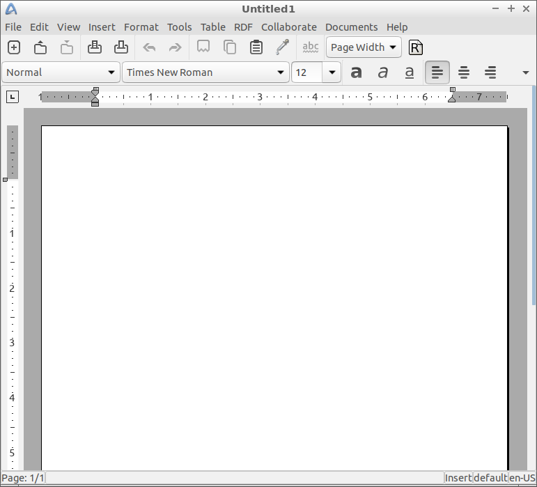

Chapter 3.2.1 Abiword
=====================

Description
-----------
Abiword is a simple lightweight word processing program. 

Version
-------
Lubuntu ships with version 3.0.2

Screenshot
----------

Useage
------
To use abiword you type your document into the the window. You can save your document by clicking the icon that looks like a disk with an icon pointing down on it on the toolbar. If you wish to open this document again after say you shutdown your computer click the button that looks like a folder and a dialog will pop up to find the document. You can check your spelling with the button that says abc with a green squiggly line underneath it. To print press the icon that uses a printer with a down arrow underneath it. 

How to Launch
-------------
To launch abiword in the main menu under office click the icon that looks like a piece of paper and a pen with a blue stripe on the left hand side. Alternatively you can run abiword from the command line. 
