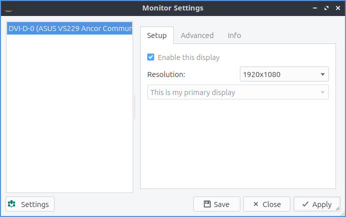

Chapter 3.2.10 Monitor Settings
===============================

Montior settings controls your monitor(s) resolution and refresh rate.

Version
-------
Lubuntu ships with version 0.13.0 of monitor settings.

Useage
------
If you use a single monitor you can change your single monitor resolution on the right hand size and select your resolution. When you change your resolution you will be asked to confirm to make sure you don't make a chocie that makes it harder to use your computer. 

If you want to rotate a monitor on the advanced tab from the  menu labeled rotation choose the way you want to rotate the monitor with inverted being upsdie down. Below you can also choose the refresh rate of monitor from the drop down menu to choose how fast your monitor refreshes.  

To display info on your monitor click the info tab and read that info. 

With multiple monitors you can in the set position you can drag the different screen around drag the two monitors around. The fast menu extended view sets you to set extended showing different things on different monitors. Selecting a unified view shows the same thing on both screens. First only shows up the first screen while second only shows only the second.  

Screenshot
----------

How to launch
-------------

To launch monitor settings from the menu :menuselection:`Preferences --> LXQt settings --> Monitor settings`. From lxqt-configuration-center press the button for monitor settings that looks like a desktop monitor or run

.. code::

  lxqt-config-monitor 
  
from the command line. 
