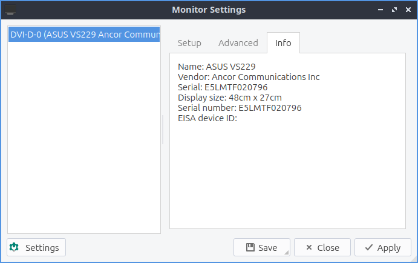
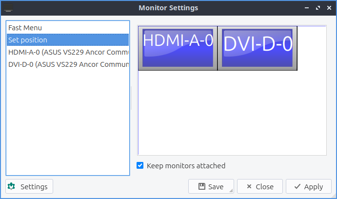

Chapter 3.2.10 Monitor Settings
===============================

Monitor Settings controls your monitor(s) resolution, refresh rate, and saves monitor settings.

Usage
------
If you use a single monitor you can change your single monitor resolution on the right hand size and select your resolution. When you change your resolution you will be asked to confirm to make sure you don't make a choice that makes it harder to use your computer. 

.. image:: monitor_settings.png

If you want to rotate a monitor on the :guilabel:`Advanced` tab from the  menu labeled :guilabel:`Rotation` choose the way you want to rotate the monitor with inverted being upside down. Below you can also choose the refresh rate of monitor from the :guilabel:`Refresh rate` drop down menu to choose how fast your monitor refreshes.  

.. image:: advnacedmontiortab.png

To display info on your monitor click the :guilabel:`Info` tab and read that info. The fields explained will be the Name of the monitor the serial number the size of the display and the serial number.

To save your monitor settings press the :guilabel:`Save` button and a pop up will show that your have your settings OK for you and press :guilabel:`Yes`. To view your saved settings press the :guilabel:`Settings` button. Your saved settings are by default saved with the time and date of when you saved the settings. If you want to apply your saved settings press the settings button with the gear around the light bulb. To see a summary of what your saved settings are left click on your settings and preview will show on the right hand column showing a summary. To choose your saved settings press the setting you want and the :guilabel:`Apply` button and your settings will be applied. To give your saved settings a meaningful name you can press the :guilabel:`Rename` button with a name for what you want and can remember what it is. If you want to delete these setting later press the :guilabel:`Delete` button. To close monitor settings press the :kbd:`Escape` key.  

Multimonitor
------------
With multiple monitors you can in the :guilabel:`Set position` tab you can drag the different screen around drag the two monitors around. The checkbox for :guilabel:`Keep monitor attached` pulls the monitors pixels adjacent to each other. To see which screen is which you will be labeled by their name which commonly is which port it is connected to your computer with.

The :guilabel:`Fast Menu` tab has ways to quickly turn on or off different monitors. The :guilabel:`Fast options` selection :menuselection:`Extended view` sets you to set extended showing different things on different monitors. Selecting a :menuselection:`Unified view` on the :guilabel:`Fast Options` shows the same thing on both screens. :guilabel:`Only first` shows up the first screen while  :menuselection:`Only second` shows only the second. 

The tabs towards the bottom are settings for each monitor.  This also has the same settings for this monitor as you would have for a single monitor with a few additions. To turn each display on or off toggle the :guilabel:`Enable this display` checkbox. Towards the bottom there is a drop down menu that and select :menuselection:`This is my primary Display` to make this your main monitor. If you select :menuselection:`This screen extends another display` this monitor will be a secondary monitor that shows something different than what the primary display shows. After selecting to extending another display two boxes will show up for where to place the second monitor.The box that shows a number and says :guilabel:`(x)` is a box that lets you show how many pixels to move this display horizontally. The box that shows a number and says :guilabel:`(y)` is a box that shows how many pixels to move the display vertically.

Version
-------
Lubuntu ships with version 0.14.1 of Monitor Settings.

How to Launch
-------------

To launch Monitor Settings from the menu :menuselection:`Preferences --> LXQt settings --> Monitor settings`. From LXQt Configuration Center press the button for monitor settings that looks like a desktop monitor or run

.. code::

  lxqt-config-monitor 
  
from the command line. 
