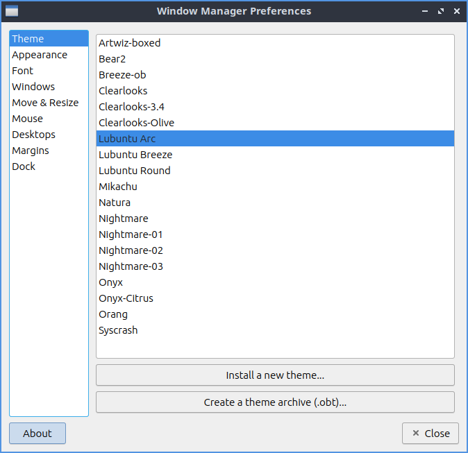
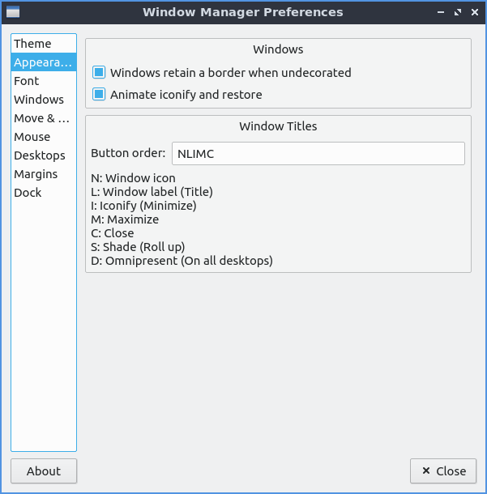
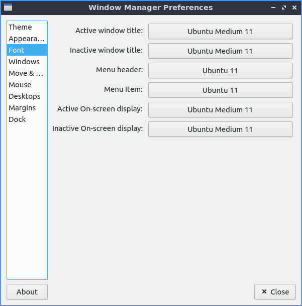
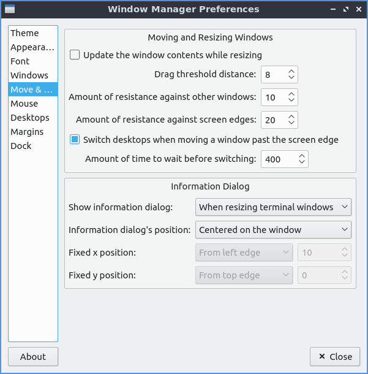
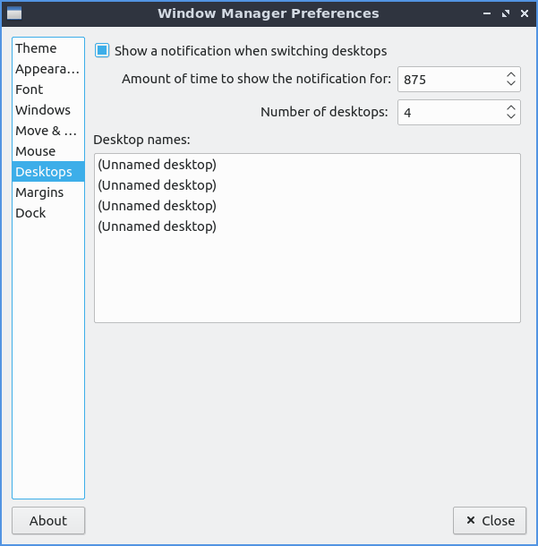

Chapter 3.2.11 Openbox Settings
===============================

Openbox settings changes configuration of openbox which is the default window manager of Lubuntu 18.10.

Version
-------
Lubuntu ships with version 0.13.0-1 of openbox settings. 

Useage
------
The :guilabel:`Theme` tab changes the titlebars. To change the theme of the titlebar select the theme on the arcieve on the and see how it looks by left clicking on the theme name. The new titlebars will immediately appear and you will see it on that window.

The :guilabel:`appearance` tab lets you change where the buttons are so for is you want and the order of the buttons on the title bar. Lubuntu ships with the abilitiy to have two additional buttons on the titlebar one for shading or rolling up with the window so you can put this in the left to right order of the letters where you want the button. To make a window show on all desktop you can add D button in box for the window order. If you want to change the window titlebar button order to have the iconifiy (minimize), maximize, and close buttons on the left then move the letters IMC to the left of L for window label or the title of the window. If you want to have the close maximize and iconify buttons first the box labled window titles should read CMI  Then L for the window label which will always be in the center. If you wanted the buttons on the right with close Maximize, iconify the window title L and then shade the window, all desktops and the window icon in the far right it should read CMILSDN. The checkbox for :guilabel:`animate iconify and restore` shows an animation when you iconify (minimize) a window and then restore it and uncheck if you really don't want theese animations. 

The :guilabel:`Windows retain a border when undecorated` checkbox has windows still have a border if you choose to undecorate them. The :guilabel:`Animate iconify and restore` checkbox runs a simpel animation when you iconify(minimize) a window or restore it. 

The :guilabel:`font` tab changes the font of your window titlebars you can select several different fonts for different conditions of the window. To change the style of the font you can under the style make the font inactive. For example if you have trouble telling which window you are in you can make the font italic for the titlebar of inactive windows to make it even more obvious.

The :guilabel:`Windows` tab manages the behavior of newly opened windows. The :guilabel:`Focus new windows when they appear` checkbox gives new windows focus when they finish opening and then be the active window as if you clicked on the icon on the taskbar. The :guilabel:`Place new Windows under the mouse pointer` puts all your new windows you open under the mouse pointer. The :guilabel:`Center new windows when they are placed` puts the new windows in the center of the monitor. 

The :guilabel:`move & resize` tab lets you change settings for moving and resizing windows. The checkbox :guilabel:`update window contents while reisizing` redraws the whole window when resizing it. Having it off will  have a drawn solid color until you stop resizing it. The drag threshold distance changes the minimum number of pixels to drag a window. The switch desktops when moving a window past the edge of a the screen lets you drag a window past the edge to switch desktops. The field for time lets you cahnge the amount of time to wait before moving beyond the edge of the desktop to another virtual desktop.   

The :guilabel:`mouse` tab use the focus follow mouse tab is if you move the mouse over the window it will automatically focus on that window. The :guilabel:`Double click on the titlebar` drop down of doubleclicking on the titlebar what option fo to shade or maiximize the window or custom actions which lubuntu has set to maximize. 

On the :guilabel:`desktops` tab to change number of desktops press the up arrow to add an additional desktop or the down arrow to reduce the number of virtual desktops. When switching desktops there is  a checkbox to show a notification and a field for how many miliseconds to show that notification for. 

To make a margin on your desktop on which nothing is placed you can set pixel margins on each side with the :guilabel:`margins` tab. 

How to launch
-------------

To launch openbox settings from the menu :menuselection:`Preferences --> LXQt settings --> openbox settings`. From LXQt settings press the openbox settings button with the wrench and screwdriver on a computer window or run

.. code:: 

   obconf-qt

from the command line.
