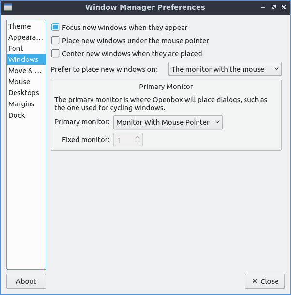
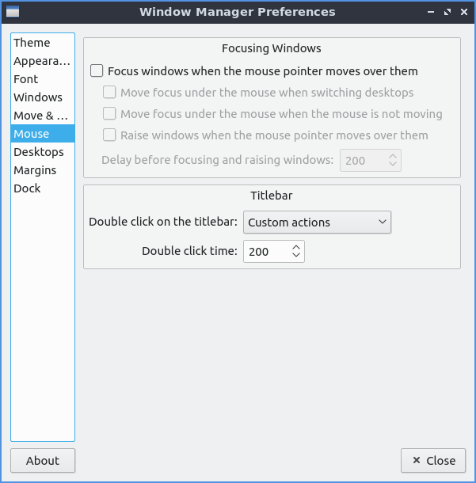

Chapter 3.2.11 Openbox Settings
===============================

Openbox settings changes configuration of openbox the default window manager of Lubuntu.

Usage
------
The :guilabel:`Theme` tab changes the titlebars and menus provided by the window manager. To change the theme of the titlebar left click on the theme name. The new titlebars will immediately appear and you will see it on that window. If you want to check what menus to close windows will look like click on the icon on the left of the titlebar.

.. image:: obconf-titlebar.png

The :guilabel:`Appearance` tab lets you change where the buttons are so for is you want and the order of the buttons on the title bar. Lubuntu ships with the ability to have two additional buttons on the titlebar one for shading or rolling up with the window so you can put this in the left to right order of the letters where you want the button. To make a window show on all desktop you can add D button in box for the :guilabel:`Button order`. If you want to change the window titlebar button order to have the iconifiy (minimize), maximize, and close buttons on the left then move the letters IMC to the left of L for window label or the title of the window. If you want to have the close maximize and iconify buttons first the box labeled window titles should read CMI  Then L for the window label which will always be in the center. If you wanted the buttons on the right with close Maximize, iconify the window title L and then shade the window, all desktops and the window icon in the far right it should read CMILSDN. 

The :guilabel:`Windows retain a border when undecorated` checkbox has windows still have a border if you choose to decorate them. The :guilabel:`Animate iconify and restore` checkbox runs a simple animation when you iconify(minimize) a window or restore it. 

.. image:: openbox-config.png

The :guilabel:`Font` tab changes the font of your window titlebars you can select several different fonts for different conditions of the window. To change the style of the font you can under the  :guilabel:`Inactive window title` field. For example if you have trouble telling which window you are in you can make the font italic for the titlebars of inactive windows to make it even more obvious. Other fonts you can change are :guilabel:`Active Window title`, :guilabel:`Menu header`, :guilabel:`Menu Item`, :guilabel:`Active On-screen display`, or :guilabel:`Inactive On-screen display`.

.. image:: obconf-font.png

The :guilabel:`Windows` tab manages the behavior of newly opened windows. The :guilabel:`Focus new windows when they appear` checkbox gives new windows focus when they finish opening and then be the active window as if you clicked on the icon on the taskbar. The :guilabel:`Place new Windows under the mouse pointer` puts all your new windows you open under the mouse pointer. The :guilabel:`Center new windows when they are placed` puts the new windows in the center of the monitor. The drop down menu for :guilabel:`Prefer to place new windows on` shows you where to place new windows on multimonitor layouts. 

The :guilabel:`Move & Resize` tab lets you change settings for moving and resizing windows. The checkbox :guilabel:`Update window contents while resizing` redraws the whole window when resizing it. Having it unchecked will have a drawn solid color until you stop resizing it. The :guilabel:`Drag threshold distance` changes the minimum number of pixels to drag a window. The :guilabel:`Switch desktops when moving a window past the edge of a the screen` lets you drag a window past the edge to switch desktops. The field for :guilabel:`Amount of time to wait before switching` lets you change the amount of time to wait before moving beyond the edge of the desktop to another virtual desktop or physical monitor. The drop down menu for :guilabel:`Show information dialog` shows how you how many characters fit on the newly resized window for always, terminal windows only, or never. The field for :guilabel:`Information dialog's position` is where to show this information dialog. 

.. image:: obconf-mv-resize.png

The :guilabel:`Mouse` tab use the focus follow mouse tab is if you move the mouse over the window it will automatically focus on that window. To automatically focus windows when the mouse cursor when the mouse pointer check the :guilabel:`Focus windows when the mouse pointer moves over them`. To change your focus to a new window check/uncheck the checkbox :guilabel:`Move focus under the mouse when switching desktops`. If you move a window with a keyboard shortcut and a different window is under it check the :guilabel:`Move focus under the mouse when the mouse is not moving` checkbox. The checkbox :guilabel:`Raise windows when the mouse pointer moves over them` moves the window up in the layers.  The :guilabel:`Double click on the titlebar` drop down of double clicking on the titlebar what option of to shade or maximize the window or custom actions which Lubuntu has set to maximize. 

On the :guilabel:`Desktops` tab to change number of desktops press the up arrow to add an additional desktop or the down arrow to reduce the number of virtual desktops. When switching desktops there is  a checkbox to show a notification and a field for how many milliseconds to show that notification for. If you want to rename a desktop double click on the desktop name and type the name of the desktop you want.

.. image:: obconfdesktop.png

To make a margin on your desktop on which nothing is placed you can set pixel margins on each side with the :guilabel:`Margins` tab. The fields :guilabel:`Left`, :guilabel:`Top`, :guilabel:`Right`, or :guilabel:`Bottom` each have a field for each number of pixels as a margin. To close openbox settings press the :kbd:`Escape` key. 

.. image:: obconf-margins.png

Version
-------
Lubuntu ships with version 0.14.1 of openbox settings. 

How to launch
-------------

To launch openbox settings from the menu :menuselection:`Preferences --> LXQt settings --> Openbox Settings`. From LXQt settings press the Openbox Settings button with the wrench and screwdriver on a computer window or run

.. code:: 

   obconf-qt

from the command line.
