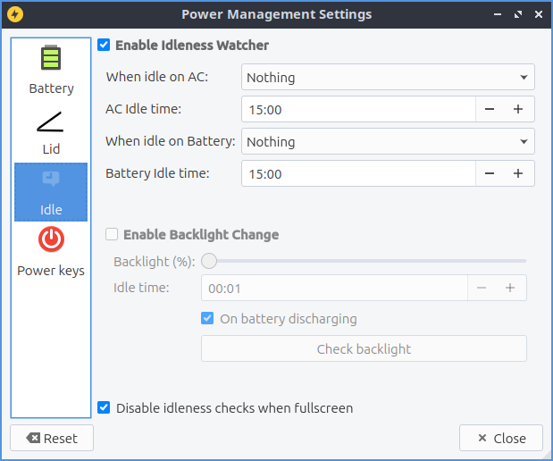

Chapter 3.2.12 Power Management
===============================

Power management manages what to do on laptop batteries when the power is low what happens when your lid to a laptop is closed and what to do when your computer is idle for long periods.

Useage
------
LXQt power management watches your battery, laptop lid, and idleness on the screen. Each one of the checkbox is to battery laptop lid and idleness is a checkbox to enable or disable each. When you add when power is low select what you want to do suspend shutodwn hibernate or something. The lid watcher lets you choose to suspend or shut off your computer when the lid is closed on battery or on AC.     

On a laptop power management should show a + with a ring around it represeneting your current battery charge on your laptop when it is charging with a full green circle meaning you are fully charged in the system tray. If your battery is discharging you will see a - sybmol at the center of the circle. If you hover the mouse cursor over this it will show the percent of charge as a percentage and whether the battery is charging or discharging. When your battery is fully charged it will turn into a black circle. 

Screenshot
----------

Version
-------
Lubuntu ships with version 0.13.0 of Power Management.  

How to Launch

To launch Power Management from the menu :menuselection:`Preferences --> LXQt settings --> Power Management`. From LXQt configuration center press the power management icon that looks like a light bulb or run

.. code:: 

    lxqt-config-powermanagement 

from the command line. 
