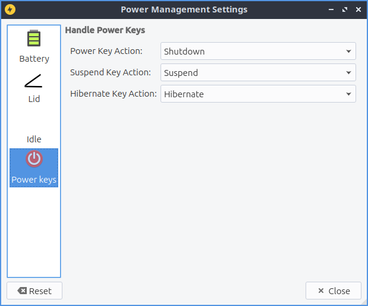

Chapter 3.2.12 Power Management
===============================

Power Management manages low charge in your laptop battery, actions for laptop lid being closed, and what to do when your computer is idle for long periods.

Usage
------
LXQt power management watches your battery, laptop lid, idleness, and what happens when you press power or sleep buttons. Each of the checkboxes for battery, laptop lid, or idleness watchers are checkboxes to enable or disable each.

The :guilabel:`Battery` tab has settings for monitoring your battery power level and some settings. On a laptop power management should show a :guilabel:`+` with a ring around it representing your current battery charge on your laptop when it is charging with a full green circle meaning you are fully charged in the system tray. If your battery is discharging you will see a :guilabel:`-` symbol at the center of the circle. If you hover the mouse cursor over this it will show the percent of charge as a percentage and whether the battery is charging or discharging. When your battery is fully charged it will turn into a black circle. 

.. image:: lxqt-power-battery.png

The field :guilabel:`Enable Battery Watcher` Watches the battery on your system. The field :guilabel:`When Power is low then:` lets you choose what to do when your batter is low. The :guilabel:`Warning` field provides a duration to show a warning for low power. To change the level for low level of battery change the :guilabel:`Level is low at` field. To toggle showing and icon check/uncheck the :guilabel:`Show icon` checkbox. To change the icon used for battery change the :guilabel:`Icon` drop down. If you are using a virtual machine or desktop without a battery and get annoyed that notification saying no battery at first login simply uncheck the :guilabel:`Enable Battery Watcher` checkbox. To see what your battery will look like it is under the text :guilabel:`Preview` text in the bottom of the screen. To show what the battery would look like at different charges change the :guilabel:`Label` slider.

The :guilabel:`Lid` tab manages settings for when you close your laptop lid. The lid watcher lets you choose to suspend or shut off your computer when the lid is closed on battery or on AC. The checkbox for :guilabel:`Enable Lid Watcher` enables actions to be taken when the laptop lid is closed and of course uncheck means it won't take any action. The :guilabel:`On Battery` field changes what action to take when your laptop is powered by the battery. The :guilabel:`On AC` is changes what action to take when your laptop lid is closed and it is plugged into power. 

.. image:: lid watcher.png

The Checkbox :guilabel:`When using external monitor` Allows you to have different settings when your laptop for closing the lid if you are plugged in to an external monitor. The fields :guilabel:`On Battery` and :guilabel:`On AC` function as above just different settings when plugged into an external monitor. 

The :guilabel:`Idle` tab manages what happens when you walk away from your keyboard. The :guilabel:`When idle on AC` you select whether you want to do Nothing, Lock Screen, Suspend, hibernate, Shutdown, or Turn Off Monitor(s) when your computer is plugged in. The :guilabel:`On Battery` field tell you how long to wait when you are away before the idleness watcher takes the action you wish. To change when what happens when your computer is unplugged change the :guilabel:`When idle on Battery` field. To change how long to change what happens when the idle when your computer is unplugged change :guilabel:`Battery idle time` field.

To enable changing the backlight brightness when your computer is idle check the :guilabel:`Enable Backlight Change` checkbox. To change the bright the screen becomes when idle :guilabel:`Backlight(%)` slider as lowering the brightness will use less power. To change how long to reduce your brightness on your laptop change the :guilabel:`Idle time` field. To have the screen reduce brightness even when plugged in uncheck the :guilabel:`On battery discharging` checkbox. To disable changing the screen when you have a window fullscreen check the :guilabel:`Disable idleness when fullscreen` checkbox.

.. image:: power_management.png

To change what buttons do in regards to power use the :guilabel:`Power keys` tab. To change what the power button does change :guilabel:`Power Key Action` to what you want to happen when you press the power button on your computer. To change what the suspend button does use the :guilabel:`Suspend Key Action` menu. To change what the hibernate button  does use the :guilabel:`Hibernate Key Action` menu.

To reset your changes press the :guilabel:`Reset` button. To close Power Management press the :kbd:`Escape` key or press the :guilabel:`Close` button.

Version
-------
Lubuntu ships with version 1.1.0 of Power Management. 

How to Launch
-------------

To launch Power Management from the menu :menuselection:`Preferences --> LXQt settings --> Power Management`. The Power Management icon looks like a yellow circle with a black lightning bolt. You can also run 

.. code:: 

    lxqt-config-powermanagement 

from the command line. You can launch Power Management from the panel by right clicking on the battery icon and select :menuselection:`Configure`.
