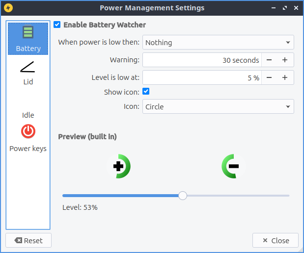
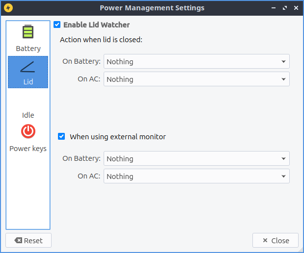

Chapter 3.2.12 Power Management
===============================

Power management manages what to do on laptop batteries when the power is low what happens when your lid to a laptop is closed and what to do when your computer is idle for long periods.

Usage
------
LXQt power management watches your battery, laptop lid, and idleness on the screen. Each one of the checkbox is to battery laptop lid and idleness is a checkbox to enable or disable each.

The :guilabel:`Battery` tab has settings for monitoring your battery power level and some settings. On a laptop power management should show a + with a ring around it representing your current battery charge on your laptop when it is charging with a full green circle meaning you are fully charged in the system tray. If your battery is discharging you will see a - symbol at the center of the circle. If you hover the mouse cursor over this it will show the percent of charge as a percentage and whether the battery is charging or discharging. When your battery is fully charged it will turn into a black circle. 

The field :guilabel:`Enable Battery Watcher` Watches the battery on your system. The field :guilabel:`When Power is low then:` lets you choose what to do when your batter is low. The :guilabel:`Warning` field provides a duration to show a warning for low power. To change the level for low level of battery change the :guilabel:`Level is low at` field. The checkbox :guilabel:`Use icons from theme` changes the appearance of your battery to be the battery icon from your icon theme. If you are using a virtual machine or desktop without a battery and get annoyed that notification saying no battery at first login simply uncheck the :guilabel:`Enable Battery Watcher` checkbox.                                                            

The :guilabel:`Lid` tab manages settings for when you close your laptop lid. The lid watcher lets you choose to suspend or shut off your computer when the lid is closed on battery or on AC. The checkbox for :guilabel:`Enable Lid Watcher` enables actions to be taken when the laptop lid is closed and of course unchecking means it won't take any action. The :guilabel:`On battery` field changes what action to take when your laptop which each does it like it sounds like. The :guilabel:`On AC` is changes what action to take when your laptop lid is closed and it is plugged into power.  

The Checkbox :guilabel:`When using external monitor` Allows you to have different settings when your laptop for closing the lid if you are plugged in to an external monitor. The fields :guilabel:`On Battery` and :guilabel:`On AC` function as above just different settings when plugged into an external monitor. 

The :guilabel:`Idle` tab manages what happens when you walk away from your keyboard. The :guilabel:`When idle then` you slect whether you want to do nothing, Lock Screen, Suspend, hibernate, Shutdown or turn off monitor. The :guilabel:`Idle time` fields tell you how long to wait when you are away before the idleness watcher takes the action you wish. 

To reset your changes if you decide not to use them press the :guilabel:`Reset` button. To close power management press the :kbd:`Escape` key.

Screenshot
----------
.. image:: power_management.png

Version
-------
Lubuntu ships with version 0.14.1 of Power Management.  

How to Launch

To launch Power Management from the menu :menuselection:`Preferences --> LXQt settings --> Power Management`. From LXQt configuration center press the Power Management icon that looks like a light bulb or run

.. code:: 

    lxqt-config-powermanagement 

from the command line. You can launch Power Management from the panel by right clicking on the battery icon and select :menuselection:`Configure`.
