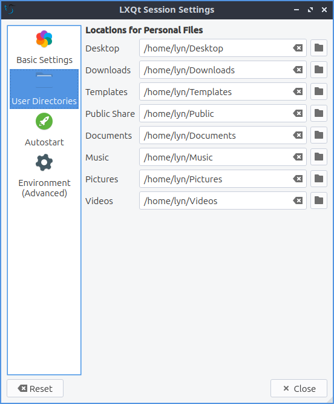
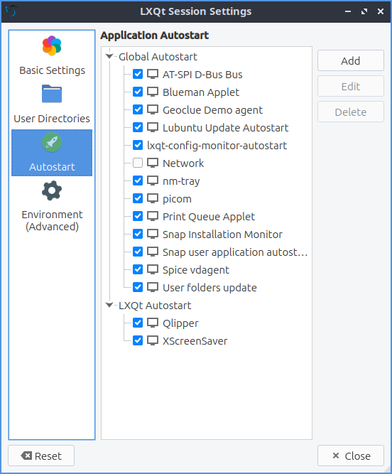
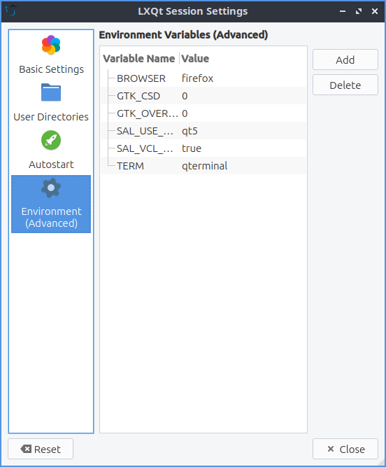

Chapter 3.2.13 Session Settings
===============================

Session Settings is the way to change what happens when log into Lubuntu. Here you can manage default applications and services at startup.

Usage
------
The :guilabel:`Basic Settings` tab lets you change with a window manager  and LXQt modules. To change the window manager used by LXQt, on the basic settings tab use the :guilabel:`Window Manager` drop down menu labeled window manager. Choose from the drop down list or :guilabel:`Search` if the drop down list does not contain your new window manager. LXQt modules lists the different part of LXQt if you find you do not want part of LXQt active you can enable or disable them here. If you wish to start the compton X11 compositor you can do so here, we have chosen to disable it at default to lower system resources by default. To stop an LXQt Module left click on the module name press the :guilabel:`Stop` button. To start a stopped LXQt Modules press the :guilabel:`Start` button. If you want to restart part of LXQt without using the command line first press the :guilabel:`Stop` button and then the :guilabel:`Start` button.

.. image:: sessionsettings-basic.png

The checkbox for :guilabel:`Ask confirmation to leave session` gives you a simple yes no dialog to make sure you really want to leave so you do not lose your work uncheck it if you do not want this and find this dialog annoying. The :guilabel:`Lock screen before suspending/hibernating` checkbox locks your screen before suspending and hibernating and is checked by default unchecking this will leave this so the screen is not unlocked after suspending or hibernating. To change how long to wait after locking the screen to delay or suspend change the :guilabel:`Suspend/hibernate after lock delay` field. 

The :guilabel:`Default Applications` tab lets you change your default browser and terminal emulator. The drop down for :guilabel:`Terminal Emulator` lets you change the terminal emulator and the drop down for :guilabel:`Web Browser` lets you change your webbrowser.

.. image:: default-app-tabs.png

To change where LXQt saves the default user directories left click on the :guilabel:`User Directories` tab. To view what folder to change the default location for use the :guilabel:`Desktop`, :guilabel:`Downloads`, :guilabel:`Templates`, :guilabel:`Public Share`, :guilabel:`Documents`, :guilabel:`Music`, :guilabel:`Pictures`, or :guilabel:`Videos` field to change that default folder for that. To bring up a dialog to change your folder press the folder button. In the center shows the current path to your documents. To go back to the default folder press the leftward pointing arrow with an x in it.

The :guilabel:`Autostart` tab has settings for what to autostart. The autostart applications lets you choose which applications to autostart like managers for print queues. All of these are check-boxes to start various programs. You can start a program at startup by adding it here. Click the :guilabel:`Add` button, give the process a name e.g. "Terminal drop down" and type in the :guilabel:`Name` and type appropriate terminal command e.g. "qterminal -d" where it says :guilabel:`Command`. If you are say autostarting a clipboard manager or something else that needs to be in a system tray check the :guilabel:`Wait for system tray` checkbox so the application does not autostart before the system tray and does not end up running. To change a keyboard shortcut press the :guilabel:`Edit` button. To remove a setting for autostart first uncheck the checkbox to disable autostarting that program then left click on the autostart press the :guilabel:`Delete` button. 

The tab for :guilabel:`Environment (Advanced)` has many effects for you environment variables for your session. The :guilabel:`Variable Name` provides the name of the environment variable. To change the value of a variable double click on the value under the :guilabel:`Value` column. To add a new environment variable press the :guilabel:`Add` button. Then at the bottom a dotted line will appear and double click to enter the Variable Name and the Value for the variable. To delete an environment variable press the :guilabel:`Delete` button. Several of these variables relate to hidpi support see `<https://forum.lxqt.org/t/detailed-guide-to-enable-high-dpi-scaling-on-lxqt/507/5>`_ . To change your cursor size change the XCURSOR_SIZE variable.

If you want to undo changes you have done press the :guilabel:`Reset` button. To close session settings press the :kbd:`Escape` key.

Version
-------
Lubuntu ships with version 0.14.1 of Session Settings. 

How to Launch
-------------
To launch Session Settings from the menu :menuselection:`Preferences --> LXQt settings --> Session Settings`. The icon for Session Settings looks like a gear with a white circle on top. To run Session Settings from the command line run 

.. code:: 

   lxqt-config-session 
