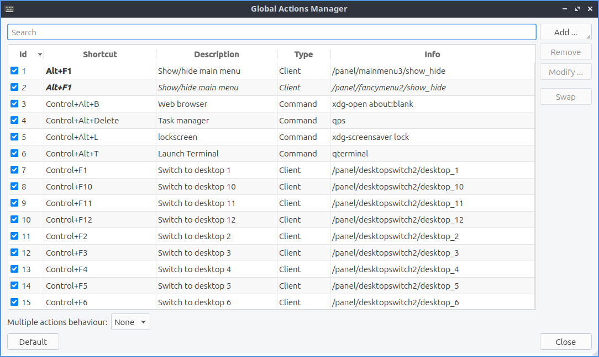

Chapter 3.2.14 Shortcut keys
============================

Shortcut keys is a program that manages the global hotkeys or keyboard shortcuts for Lubuntu.

.. note::
    The keyboard shortcuts are also managed by Openbox. Refer to Appendix F for more detail.

Version
-------
Lubuntu ships with version 0.14.1 of shortcut keys.

Usage
------
You can **Modify** a current keyboard shortcut by selecting the shortcut from the keyboard table, clicking the :guilabel:`Modify` button, then clicking on the shortcut button. A countdown will begin during which you should push the **keyboard shortcut combination** you want.  

You can **Remove** a keyboard shortcut by selecting the shortcut from the keyboard table, and clicking the :guilabel:`Remove` button. To swap to shortcut keys you can select two shortcuts with :kbd:`Control+ Left Click` then left click on the :guilabel:`Swap` button.

You can **Add** a new keyboard shortcut clicking the :guilabel:`Add` button. The shortcut field will be blank, click the shortcut button to start the countdown, then press the **keyboard shortcut combination** you want to assign. Write a short description of what the keyboard shortcut does, for example "start drop down terminal", or "increases screen brightness". To make this execute a terminal command select the command radio button and enter the command in the :guilabel:`Descrption` field. 

Screenshot
----------

.. image:: add_key_ex.png

How to launch
-------------
To launch shortcut keys from the menu :menuselection:`Preferences --> LXQt settings --> Shortcut Keys`. From LXQt configuration center use shortcut keys button which looks like 6 keyboard keys or from the command line run

.. code:: 

   lxqt-config-globalkeyshortcuts 
