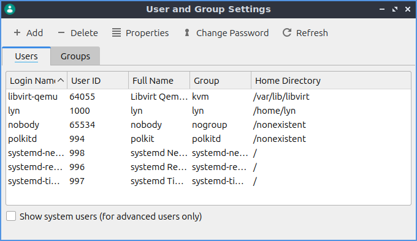
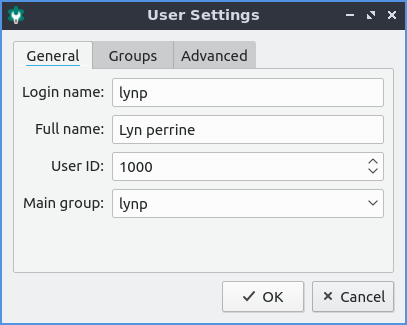
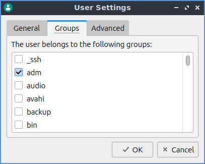
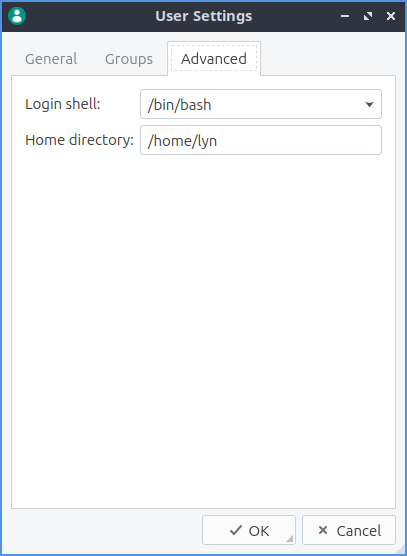
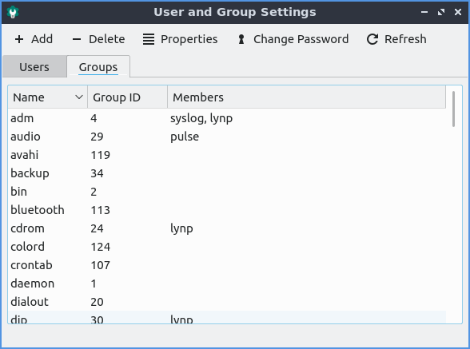

Chapter 3.2.15 Users and Groups
===============================

Users and Groups lets you manage user and group settings on your system. 

Usage
------
The :guilabel:`Users` tab lets you manage Users. To create a new user account press the :guilabel:`Add` button. You will need to select the groups you want the user to be in under the :guilabel:`Groups` tab. Once the user information and groups are set press the :guilabel:`OK` button. Then you will be prompted to enter an administrative password. Next you will be prompted to enter the new password for the user. To change the users permission click account type and enter your password and select desktop user to not give permission to change the system or admin to change system settings. 

To change a user's password select the user in the list then press the :guilabel:`Change Password` button you will be prompted to  enter the new password. Then you will be prompted to enter an administrative password to authenticate that you have permission to do this. To reload the info on users and groups press the :guilabel:`Refresh` button. 

To view an info on a particular user press the :guilabel:`Properties` or double click on the users name to bring up a dialog box or the accomplish the same thing by double clicking on the username. You can view the :guilabel:`Login Name` will show you the login name for the user and can be edited if you type in the box. The field :guilabel:`User ID` is the numerical internal id of your user. The field :guilabel:`Main Group` is the main group that is default group for files access to. 

The tab :guilabel:`Groups` under properties has checkboxes for each group you are in or which checkbox or each group you are not in. To add or remove a user from a group check or uncheck the checkbox for the group you want to add or remove a user from.

The :guilabel:`Advanced` tab in the properties menu has settings with a login shells and where your home directory is. To change which shell you use when you login via ssh or directly to a console change the :guilabel:`Login Shell` drop down menu. To change where your home directory is use the :guilabel:`Home directory` field for your folder.

The :guilabel:`Groups` tabs lets you see info on groups and change properties. The :guilabel:`Name` field shows the name of the group. The :guilabel:`Group ID` shows the numeric group id of the group in the name field. The :guilabel:`Members` show the members of the current group. 

.. warning::

   Changing user and group permissions without knowing what you are doing could break your system.

Version
-------
Lubuntu ships with version 0.14.1 of Users and Groups. 

How to Launch
-------------
To launch Users and Groups from the menu :menuselection:`Preferences --> LXQt settings --> Users and Groups`. The icon for Users and Groups is a teal circle with nondescript picture of a person. Or you can run

.. code:: 

   lxqt-admin-user 
   
from the command line.
