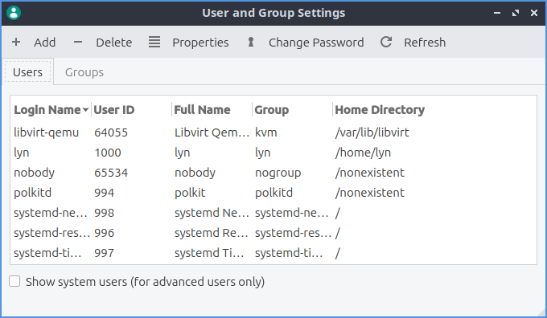

Chapter 3.2.15 Users and Groups
===============================

USers and groups lets you manage users and groups on your system. 

Version
-------
Lubuntu ships with version 0.13.0 of Users and Groups. 

Useage
------
The :guilabel:`users` tab lets you manage Users.To create a new useage create a new user enter your password to make sure it is really you enter the users name and username then enter the new password twice by hand. To change the users permission click account type and enter your password and select desktop user to not give permission to change the system or admin to change system settings.  

To change your users password you can press on the button with a key and enter the new password and enter new password and then use a password to authenticate that you have permission to do this. 

Screenshot
----------

How to launch
-------------
To launch Users and groups from the menu :menuselection:`Preferences --> LXQt settings --> users and groups`. From LXQt configuration center under system settings press the button that looks like two people. Or you can run

.. code:: 

   lxqt-admin-user 
   
from the command line.  
