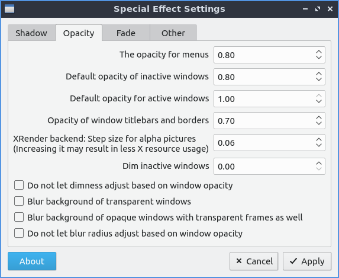
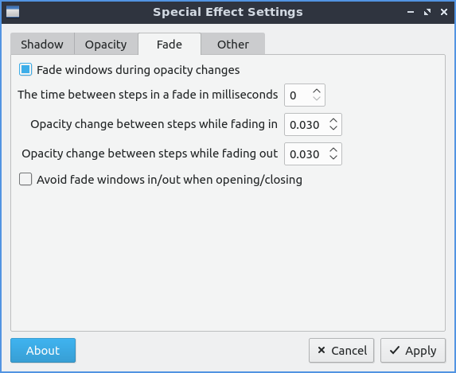
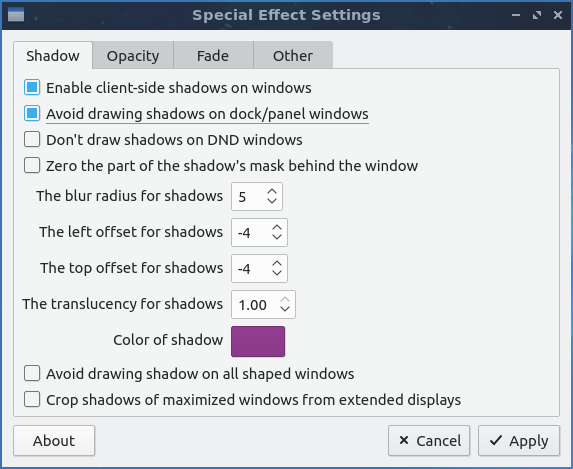

Chapter 3.2.16 Window Effects
=============================

Window effects is a program to manage effects of the Compton X compositor. 

Version
-------
Lubuntu ships with version 0.4.0 of Window effects.

Useage
------
The :guilabel:`Shadow` tab manages how compton draws shadows. To toggle enable client side shadows press the Enable client side shadows checkbox. The checkbox for Aviod drawing shadows on dock/panel windows will stop drawing shadows on the panel. The label for color lets you change the color of your shadows. The field for blur radius for shadows changes how big to blur the shadows. The :guilabel:`left offset for shadows` is how far to move the shadows to the left with a larger number makes the shadow appear farther to the right. The :guilabel:`top offset for shadows` the larger the number farther down the shadow appears below the window. The field for :guilabel:`translucany for shadows` is how opaque or clear to make the shadows 1 is opqaque shadows and 0 is clear.   

The :guilabel:`opacity` tab is for transparency settings. Setting Opacity to 1.00 makes it opaque while 0 makes it entirely clear. Menus, inactive windows, active windows titlebars and borders all can have their opacity changed indepently. The :guilabel:`Blur background of transparent windows` blurs backgound of transparent windows.

The :guilabel:`Fade` tab manages fading windows opening or closing or opacity changes. There is a checkbox for :guilabel:`fade windows during opactity changes` so if the opacity changes it will smoothly fade. To have a slower  time between fade in miliseconds increase the :guilabel:`The time between steps in a fade in miliseconds`. With this settings windows will fade in and out when opened and closed unless you don't them to which you can check the :guilabel:`Avoid fade in out when windows opening/closing`.  

To have your settings applied you will need to press the :guilabel:`apply` button. If you want to cancel your changes press the :guilabel:`cancel` button.

Screenshot
----------

How to Launch
-------------
To launch window effects from the menu :menuselection:`Preferences --> LXQt Settings --> Window effects` or run

.. code:: 

   compton-conf 
  
from the command line. From LXQt configuration center press the gear button with a c in it to launch Window Effects. Of course for this to have any effect the compton compistor needs to be running so see chapter 3.2.13 for how to autostart applications.  
