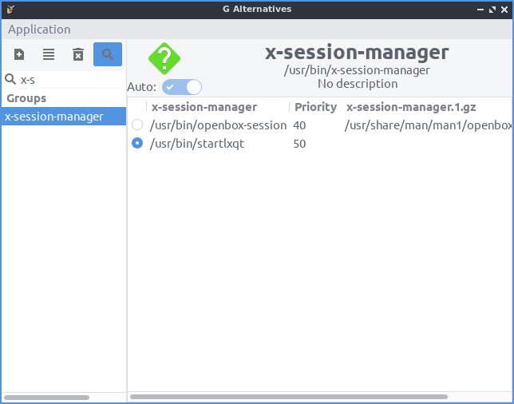

Chapter 3.2.17 Alternatives Configurator
========================================

Alternative Configuartor configures your alternatives like your default web browser and more applications. 

Usage
------
To select the command to choose your alternatives for the default program for something such as your default text editor if you have multiple programs installed by left clicking what to be the alternative on the left sidebar under the column :guilabel:`Groups`. On the right side of the window has a radio button to choose which editor you want to use. When you change your alternative you will input your password to authenticate to change your default application.

To show a search for the different application groups press the button that looks like a magnifying glass.

Version
-------
Lubuntu ships with version 1.0.3 of galternatives. 

Screenshot
----------

How to Launch
-------------
To launch Alternatives Configurator from the menu :menuselection:`Preferences --> Alternatives Configurator` or run

.. code::

   galternitives

from the command line. The icon for Alternatives Configurator is a dark gray circle with an orange G with an a inside.
