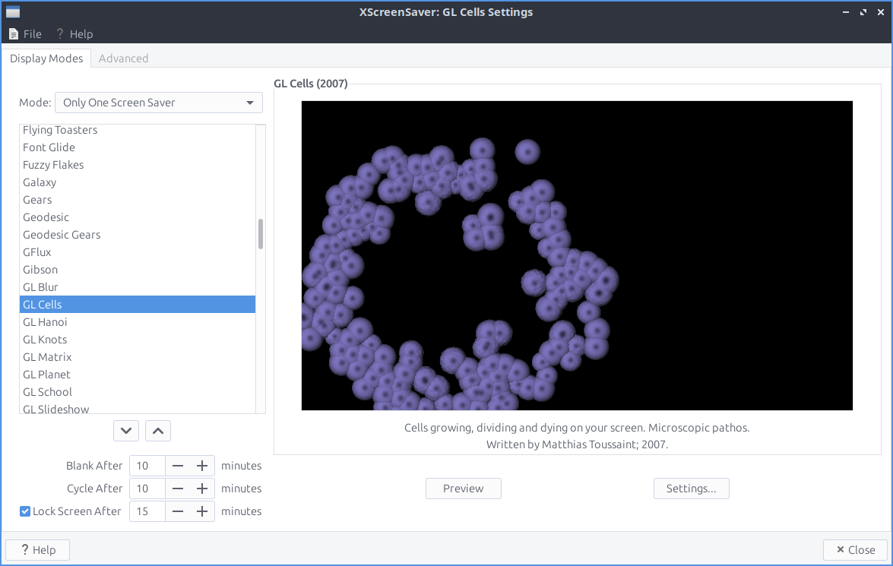
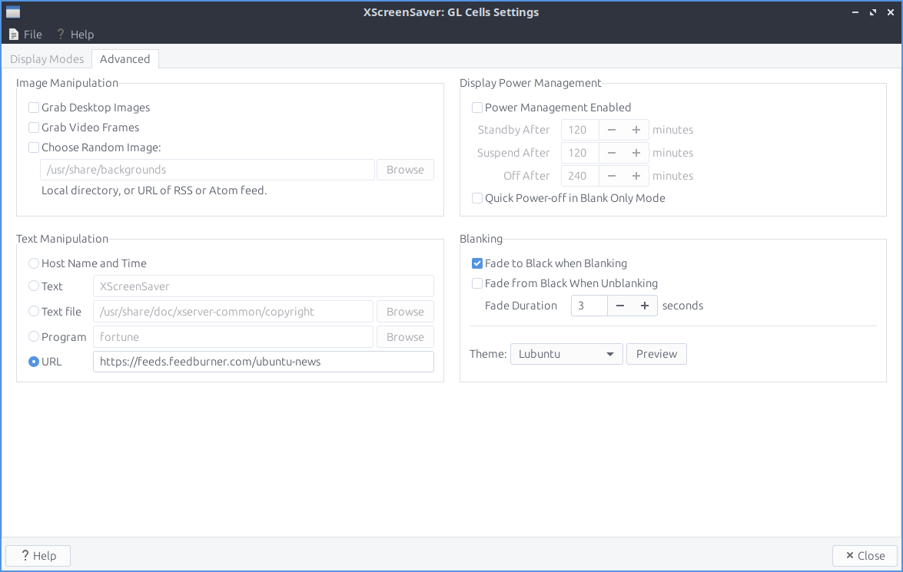

Chapter 3.2.18 Screensaver
==========================

Screensaver is an application to control what screensavers are used on the system and how long it takes to activate the screensaver. 

Usage
------
The :guilabel:`Mode` drop down has 4 settings :menuselection:`Disable Screen Saver` turns off the screensaver, :menuselection:`Blank Screen Only` just turns the screen itself off, :menuselection:`Only One Screen Saver` sets one screensaver, and :menuselection:`Random Screen Saver` selects a random screensaver. If you selected to blank the screen change the :guilabel:`Blank After` field. If you have a random screensaver set you can change with the number of minutes it says with :guilabel:`Cycle After` for when the screensaver will change to another one. Check the checkbox for :guilabel:`Lock Screen After` takes the number of minutes to lock the screen and change :guilabel:`minutes` to change how soon to lock the screen.

To change your screensaver to a different screensaver left click on the name of the screensaver on the left hand side of the screen. You can see a small preview of the screensaver on the right hand side of the window with the name of the screensaver above the preview.

If you try to select a screensaver that is not installed it will not show on the right hand side of the window. To see credit and a summary of what each screensaver is read the text under the preview of the screensaver. To preview a screensaver as when it would be activated press the :guilabel:`Preview` button. To see more settings for each individual screensaver press the :guilabel:`Settings` button.

To make the screen blank :menuselection:`File --> Blank Screen Now`. To lock your Screen :menuselection:`File --> Lock Screen Now`. If you want to kill the daemon :menuselection:`File --> Kill Daemon`. To restart the screensaver daemon :menuselection:`File --> Restart Daemon`. To restart xscreensaver :menuselection:`File --> Restart Daemon`.  

If you try to open the screensaver settings without having the screensaver daemon running you will bring up a dialog if you want to launch it.

To change to get even more settings on your screensaver use the :guilabel:`Advanced` tab. To change images in your screensaver change settings in :guilabel:`Image Manipulation` heading. 
To choose to select from your desktop background check the :guilabel:`Grab desktop images` checkbox. To change a random background image check the :guilabel:`Choose Random Image` checkbox. To choose which path to randomly choose wallpaer from type the path in to the left of :guilabel:`Browse` button or press the :guilabel:`Browse` button and choose the path or rss feed. 

To change turning the screen off and if to enter standby or suspend use the settings in :guilabel:`Display Power Management`. To enable xscreensaver to have power management check the :guilabel:`Power Management Enabled` checkbox. To change how fast to turn the computer into standby change the :guilabel:`Stanby After` field. To change how fast to suspend when idle change the :guilabel:`Suspend After` field. To turn the monitor off after an amount of time change the :guilabel:`Off After` field. To turn the screen off when blanking the screen check the :guilabel:`Quick Power-off in Blank Only Mode` chackbox.

To change the settings for how to make your screen blank change the :guilabel:`Blanking` settings. To have your screen fade to black when blanking check the :guilabel:`Fade to Black when Blanking` checkbox. To have your screen fade back in from screen blanking check the :guilabel:`Fade from Black When Unblanking`. To change how fast your screen fades change the :guilabel:`Fade Duration` field. 

Version
-------
Lubuntu ships with version 6.08 of Screensaver

How to Launch
-------------
To launch Screensaver from the menu :menuselection:`Preferences --> Screensaver` or run

.. code:: 

   xscreensaver-demo

from the command line. The icon for Screensaver looks like purple night picture of the sky at night.
