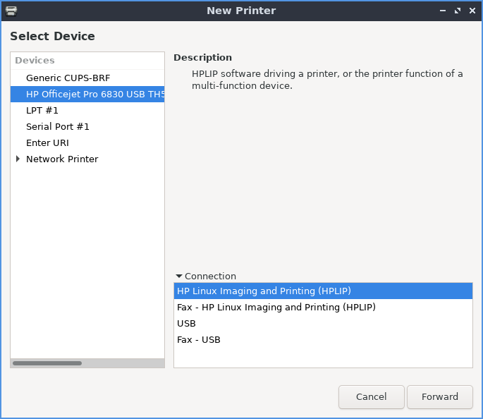
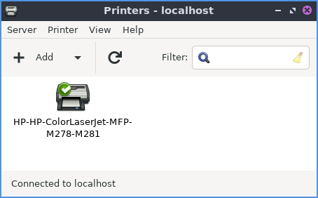

Chapter 3.2.19 Printers
=======================

Printers allows you to configure your printer and show your print queue.

Usage
------
To view your print queue right click on the printer and right click view print queue or with the printer selected press :kbd:`Control+F` or :menuselection:`Printer --> View Print Queue` and if a job is held you can restart it. To view the properties of printer or make changes with :menuselection:`Printer --> Properties`. 

To add a new printer press the :guilabel:`Add` button or :menuselection:`Server --> New --> Printer`. A dialog will popup showing where you can connect the printer. Then look for your printer in the sidebar on the left hand side. Left click on the name of your printer and press the :guilabel:`Forward` button. To change the name of your printer type it in the :guilabel:`Printer Name` field. To change the description of your printer type in the :guilabel:`Description` field. To have a location for the printer type in the :guilabel:`Location` field.

If you want to delete a printer :menuselection:`Printer --> Delete` after left clicking on the printer will delete the printer after you left click on it and you will be asked to confirm so you do not accidentally delete your printer.

Screenshot
----------

Version
-------
Lubuntu ships with version 1.5.11 of printers.

How to launch
-------------
To launch printers from the menu :menuselection:`Preferences --> Printers` or run

.. code:: 

   system-config-printer 
   
from the command line. 

