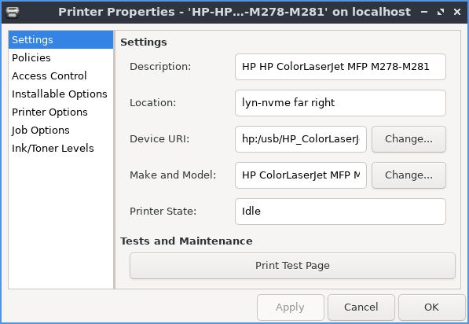
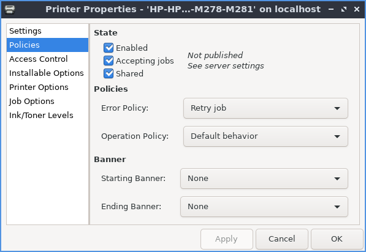
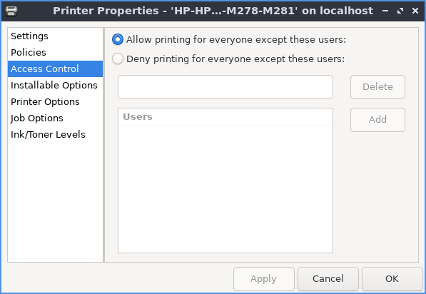

Chapter 3.2.19 Printers
=======================

Printers allows you to configure your printer(s) and show your print queue.

Usage
------
To view your print queue right click on the printer and right click :menuselection:`View Print Queue`, with the printer selected press :kbd:`Control+F`, or :menuselection:`Printer --> View Print Queue` and if a job is held you can restart it. 

To add a new printer press the :guilabel:`Add` button or :menuselection:`Server --> New --> Printer`. A dialog will popup showing where you can connect the printer. Then look for your printer in the sidebar on the left hand side. Left click on the name of your printer and press the :guilabel:`Forward` button. To change the name of your printer type it in the :guilabel:`Printer Name` field. To change the description of your printer type in the :guilabel:`Description` field. To have a location for the printer type in the :guilabel:`Location` field. To move to the next step press the :guilabel:`Forward` button. After this a dialog will pop up asking if you want to print a test page. 

.. image::   new_printer.png

If you want to delete a printer :menuselection:`Printer --> Delete` after left clicking on the printer will delete the printer after you left click on it and you will be asked to confirm so you do not accidentally delete your printer. If you have multiple printers and want to set one as default right click on the printer and select :menuselection:`Set As Default`. To change the name of your printer right click on the printer and select :menuselection:`Rename` or :menuselection:`Printer --> Rename`.

To view or change the properties of printer or make changes with :menuselection:`Printer --> Properties`. To see settings on the printer has use the :guilabel:`Settings` tab. To change how to describe and name your :guilabel:`Description` field. To change where the location of this printer is change the :guilabel:`Location` field. To choose a different driver to use for your printer press the :guilabel:`Change` button to the right of :guilabel:`Make and Model`. To print a test page press the :guilabel:`Print Test Page` button.

To change what your printer changes on errors or is enabled and banners use the :guilabel:`Policies` tab. To disable the printer uncheck the :guilabel:`Enabled` checkbox. To have the printer not accept jobs uncheck the :guilabel:`Accepting jobs` checkbox. To not share your printer uncheck the :guilabel:`Shared` checkbox. To change what to do when your printer encounters an error change the :guilabel:`Error Policy` drop down menu. To have a banner before you start printing use the :guilabel:`Starting Banner` drop down. To have a banner ending what you print use the :guilabel:`Ending Banner` drop down.

If you want to change which users can use this printer use the :guilabel:`Access Control` tab. To add a user to not be allowed to print type there name in the bar and press the :guilabel:`Add` button. To remove a user from this list left click on the username and click the :guilabel:`Delete` button. To switch to only allowing users on the list to print press the :guilabel:`Deny printing for everyone except these users` button. To switch back to banning users from printing press the :guilabel:`Allow printing for everyone except these users` checkbox.

To choose settings specific to your printer use the :guilabel:`Printer Options` tab. To choose your paper size use the :guilabel:`Media Size` drop down. To have your printer collate select :menuselection:`On` from the :guilabel:`Collate` drop down menu. To print color as gray check the :guilabel:`Print Color as Gray` checkbox. 

.. image:: prop-printer-option.png

To close printers press :kbd:`Control+Q`.

Screenshot
----------
.. image:: printers.png

Version
-------
Lubuntu ships with version 1.5.11 of printers.

How to Launch
-------------
To launch Printers from the menu :menuselection:`Preferences --> Printers` or run

.. code:: 

   system-config-printer 
   
from the command line. 

