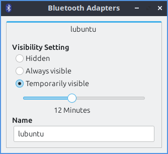

Chapter 3.2.19 Bluetooth Manager
================================
Bluetooth Manager connects to your machine to other device via Bluetooth.

Usage
-----
To search for Bluetooth devices press the :guilabel:`Search` button. The Bluetooth devices you will have found will be shown in the center of the window.

To pair with a device press the :guilabel:`Key` button. After pairing for the first time you will be asked permissions based on what type of device it is press :guilabel:`Accept` to allow access or :guilabel:`Deny` to not allow access. To mark a device as trusted press the :guilabel:`Checkmark` button. To remove a device from your device list press the :guilabel:`-` button or :menuselection:`Device --> Remove`.

.. image:: blueman.png

To change settings on whether your Bluetooth is visible to other devices or your name on Bluetooth select :menuselection:`Adapter --> Preferences`. To make your Bluetooth not show up when other people are selecting Bluetooth devices to connect to select :guilabel:`Hidden`. To have your Bluetooth adapter show up whenever anyone searches select :guilabel:`Always visible`. To have your Bluetooth appear for a short amount of time select :guilabel:`Temporarily Visible` and then use the slider to select the amount of time to make the adapter visible. To change the name you show up on bluetooth type your name in the :guilabel:`Name` field.

To transfer a file over Bluetooth press the :guilabel:`Send file` button or right click the adapter and select :menuselection:`Send a file`. Then a file picker will pop up to select the file. The recipient of the file may be prompted to need to accept the file.

To connect to a saved Bluetooth device left click to select the device and :menuselection:`Device --> Connect` or right click and select :menuselection:`Connect`.  To cancel a connection press the :guilabel:`X` button. To view info on a paired device :menuselection:`Device --> Info` or right click and select :menuselection:`Info`. To block a device :menuselection:`Device --> Block` or right click and select :menuselection:`Block`. To disconnect a device :menuselection:`Device --> Disconnect`. To rename a Bluetooth device :menuselection:`Device --> Rename device` or right click on a device :menuselection:`Rename device`. and type in what you want and press :guilabel:`OK`. To remove a device :menuselection:`Device --> Remove` or right click :menuselection:`Remove`.

On the bottom of the window there shows you statistic about how much data has been sent over Bluetooth first how much you uploaded, downloaded and then the speed of the connection.

To toggle showing the toolbar check/uncheck :menuselection:`Device --> Show Toolbar`. To toggling showing the statusbar :menuselection:`Device --> Show Statusbar`. To hide unnamed devices :menuselection:`View --> Hide unnamed devices`.

Version
-------
Lubuntu ships with version 2.4.4 of Bluetooth Manager.

How To Launch
-------------
To launch Bluetooth Manager :menuselection:`Preferences --> Bluetooth Manager` or run 

.. code::

   blueman-manager
   
   
from the command line.
