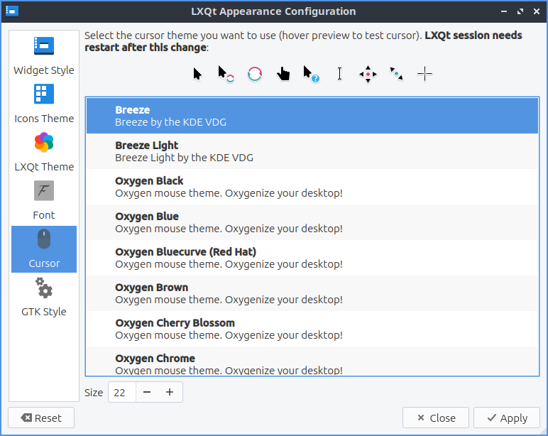

Chapter 3.2.2 Appearance
========================

Appearance is the default program that changes the theming of LXQt for a different visual look.

Usage
------
The tab :guilabel:`Widget Style` changes the way windows, buttons, and menus are drawn. To change the usage Qt widget will change the buttons and tooblbars look on Lubuntu in Qt applications. Check the checkbox :guilabel:`Set GTk themes` settings will apply native themes to GTk applications. The field for :guilabel:`GTK 2 Theme` will select a theme for GTK2 applications. The :guilabel:`GTK 3 Theme` field sets the theme for GTK3 applications. The checkbox :guilabel:`Activate on single click` has makes things you normally need two clicks for one click.  

 .. image:: appearance.png

The :guilabel:`Icons Theme` tab changes desktop icons on your computer and if you click on the icon theme which is previewed on horizontal rows. The icon theme changes how all the icon look and how some button looks in other windows such as the reset button as well. The :guilabel:`Colorize Icons based on widget style` will slightly change the background icons with the color of the background. However changing an icon theme may not apply until the application is restarted or you log out and back in again. 

 .. image:: appearance-icon-theme.png

The tab for :guilabel:`LXQt Theme` lets you change how the panel and notifications appear. To change the theme left click on the theme name to change the theme. To the left of the theme name there is a small preview of the panel and the default button for the panel. The checkbox :guilabel:`Override user-defined wallpaper` changes your wallpaper to one that comes with the LXQt theme. 

.. image::  lxqt-theme-tab.png

The :guilabel:`Font` tab has settings for fonts. To change the font size that desktop applications use choose the font tab and change the :guilabel:`Point size` and enter in the size you want or use the up and down arrows to increase or decrease font size respectively. To change the default font there is the :guilabel:`Font name` drop down that you can type the font name you or select from the drop down menu. The checkbox for  :guilabel:`Use antialias fonts` and :guilabel:`Font hinting` for fonts lets you also set antialiased fonts which are enabled for easier screen viewing. The :guilabel:`Resolution(DPI)` sets the resolution or dots per inch of the screen. To change how much the fonts are hinted change the :guilabel:`Font hinting style` drop down menu. 

.. image:: appearance-font.png

The :guilabel:`Cursor` tab has one option to change cursor theme lets you change how the cursor looks with two themes installed by default but more available in the package repositories. To see a preview of the cursor theme it is above all the cursor theme on above the list of themes and moving the cursor turns it into that preview one of cursor to see things spin for example. 

If you want to reset your changes you will need to click the :guilabel:`Reset` button to revert your changes to how they were before. To actually quit by the keyboard press the :kbd:`Escape` key or press the :guilabel:`Close` button.

Version
-------
Lubuntu ships with version 0.14.1 of Appearance. 

How to Launch
-------------
To launch Appearance in the menu :menuselection:`Preferences --> LXQt settings --> Appearance`. Another way to launch Appearance is to press the Appearance button from LXQt configuration center or run

.. code:: 

    lxqt-config-appearance 
    
from the command line. The icon for Appearance looks like a screenshot of a monitor with a window on it.
