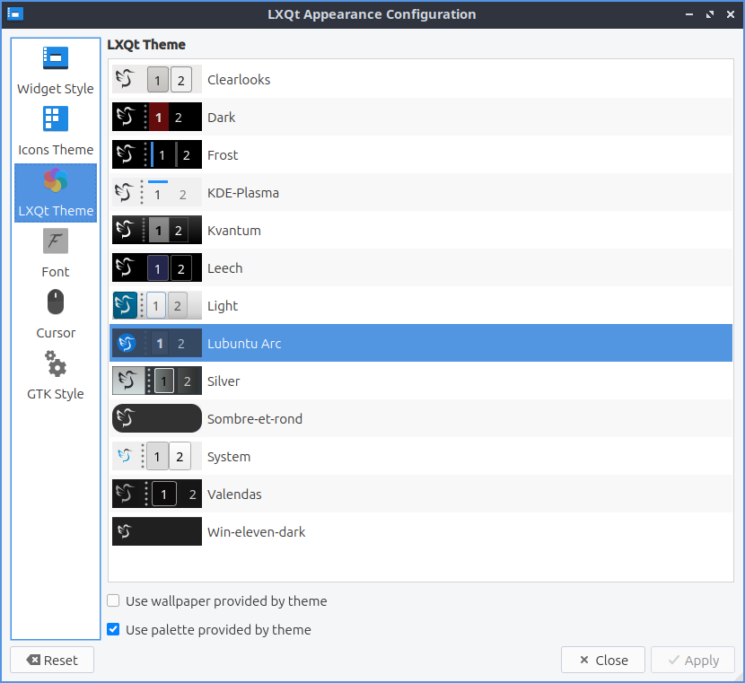
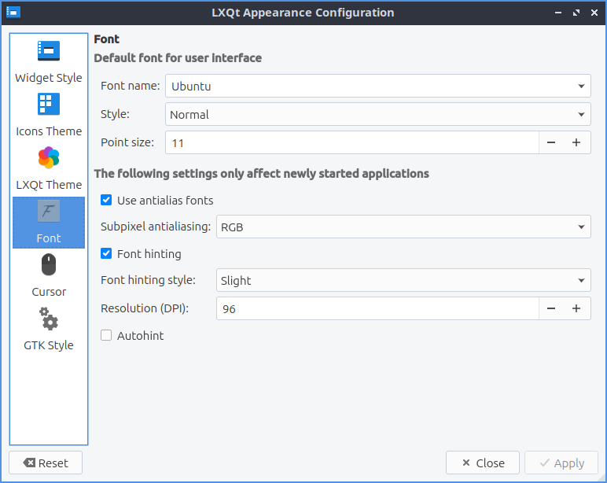

Chapter 3.2.2 Appearance
========================

Appearance is the default program that changes the theming of LXQt for a different visual look.

Usage
------

The tab :guilabel:`Widget Style` changes the way windows, buttons, and menus are drawn. To change how buttons and toolbars look on Lubuntu in Qt applications use the :guilabel:`Qt Style` menu. To install more Qt styles install packages with kde-style in the name. The section :guilabel:`Qt Palate` changes colors on Qt applications. To change the background color of windows use the :guilabel:`Window` button and then choose your color. To change foreground elements colors use the :guilabel:`View` menu. To change the color of selected buttons and text change the :guilabel:`Selection` button. To change the color of hyperlinks on windows change the :guilabel:`Link` button. To change how the text of windows appears change the :guilabel:`Window Text` field. To change the color of text on buttons change the :guilabel:`View Text` button. To change the color of text you have selected press the :guilabel:`Selected Text` button. to change the color of links you have visited press the :guilabel:`Visited Link` button. To change your colors back to default press the :guilabel:`Default Palette` button and then press :guilabel:`Apply`. To save your current custom pallette press the :guilabel:`Save Palette` button enter a name and press :guilabel:`OK`. To load another palette press the :guilabel:`Load Palette` button and then left click on the palette you want and press :guilabel:`OK`.  The checkbox :guilabel:`Activate on single click` checkbox has makes things you normally need two clicks for one click. 

 .. image:: appearance.png

The :guilabel:`Icons Theme` tab changes desktop icons on your computer and if you click on the icon theme which is previewed on horizontal rows. To find more icon-themes install packages with icon-theme in the name. The icon theme changes how all the icon look and how some button looks in other windows such as the reset button as well. The :guilabel:`Colorize Icons based on widget style` will slightly change the background icons with the color of the background. However changing an icon theme may not apply until the application is restarted or you log out and back in again. 

 .. image:: appearance-icon-theme.png

The tab for :guilabel:`LXQt Theme` lets you change how the panel and notifications appear. To change the theme left click on the theme name to change the theme. To the left of the theme name there is a small preview of the panel and the default button for the panel. The checkbox :guilabel:`Override user-defined wallpaper` changes your wallpaper to one that comes with the LXQt theme. 

The :guilabel:`Font` tab has settings for fonts. To change the default font there is the :guilabel:`Font name` drop down that you can type the font name you or select from the drop down menu.  To make the font bold or italic change the :guilabel:`Style` menu. To change the font size that desktop applications use choose the font tab and change the :guilabel:`Point size` and enter in the size you want or use the up and down arrows to increase or decrease font size respectively. The checkbox for  :guilabel:`Use antialias fonts` and :guilabel:`Font hinting` for fonts lets you also set antialiased fonts which are enabled for easier screen viewing. To change how much the fonts are hinted change the :guilabel:`Font hinting style` drop down menu. The :guilabel:`Resolution(DPI)` sets the resolution or dots per inch of the screen. 

The :guilabel:`Cursor` tab has one option to change cursor theme lets you change how the cursor looks with two themes installed by default. To get more cursor themes install packages with cursor theme in the name. To see a preview of the cursor theme it is above all the cursor theme on above the list of themes and moving the cursor turns it into that preview one of cursor to see things spin for example. To change how big the cursor is change the :guilabel:`Size` field.

.. image:: appearance-cursor.png

To manage settings for GTK applications use the :guilabel:`GTK Style` tab. Check the checkbox :guilabel:`Set GTK themes` settings will apply native themes to GTK applications. The field for :guilabel:`GTK 2 Theme` will select a theme for GTK2 applications. The :guilabel:`GTK 3 Theme` field sets the theme for GTK3 applications.

If you want to reset your changes you will need to click the :guilabel:`Reset` button to revert your changes to how they were before. To actually quit by the keyboard press the :kbd:`Escape` key or press the :guilabel:`Close` button.

Version
-------
Lubuntu ships with version 1.4.0 of Appearance. 

How to Launch
-------------
To launch Appearance in the menu :menuselection:`Preferences --> LXQt settings --> Appearance`. Another way to launch Appearance is to press the Appearance button from LXQt configuration center or run

.. code:: 

    lxqt-config-appearance 
    
from the command line. The icon for Appearance looks like a screenshot of a monitor with a window on it.
