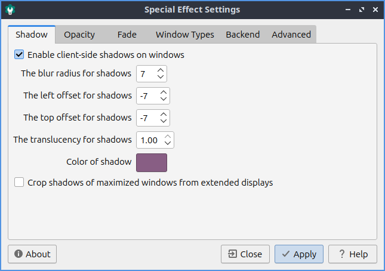
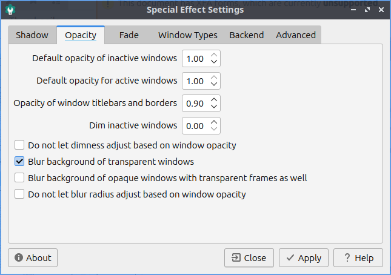
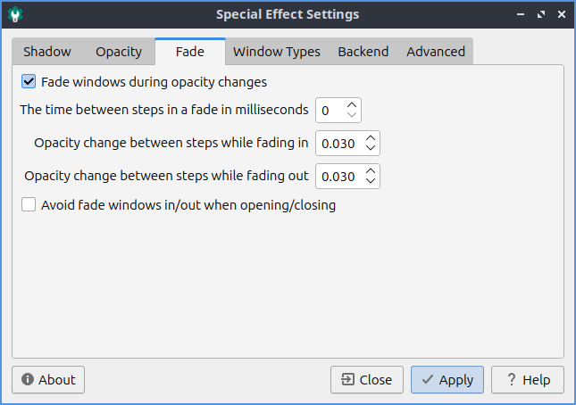

Chapter 3.2.20 Picom Configuration
==================================

Picom Configuration is the default program in Lubuntu to manage effects of the Picom X11 compositor. 

Usage
------
The :guilabel:`Shadow` tab manages how picom draws shadows. To toggle enable client side shadows press the :guilabel:`Enable client side shadows on windows` checkbox. The :guilabel:`Color of shadow` lets you change the color of shadows from windows. The field for :guilabel:`The blur radius for shadows` changes how big to blur the shadows. :guilabel:`The left offset for shadows` is how far to move the shadows to the left with a larger number makes the shadow appear farther to the right. :guilabel:`The top offset for shadows` controls where to put the shadow vertically with larger the numbers having the shadow below the window. :guilabel:`The translucency for shadows` field is how opaque or clear to make the shadows 1 is opaque shadows and 0 is clear. The :guilabel:`Crop shadows of maximized windows from extended displays` checkbox does not have shadows across multimonitor layouts on other monitors from windows on another.

The :guilabel:`Opacity` tab is for transparency settings. Setting Opacity to 1.00 makes it opaque while 0 makes it entirely clear. Menus, inactive windows, active windows, and titlebars and borders all can have their opacity changed independently. To not change how bright or dim windows are with window opacity check the :guilabel:`Do not let dimness adjust based on window opacity`. The :guilabel:`Blur background of transparent windows` blurs the background of transparent windows. To not change how far a window blurs on window transparency check the :guilabel:`Do not let blur radius adjust based on window opacity`.

The :guilabel:`Fade` tab manages fading windows opening or closing or opacity changes. There is a checkbox for :guilabel:`Fade windows during opacity changes` so if the opacity changes it will smoothly fade. To have a slower time between fade in milliseconds increase :guilabel:`The time between steps in a fade in milliseconds`. To change how much to change opacity while a window is fading in change :guilabel:`Opacity change between steps while fading in` field. To change steps when fading out change :guilabel:`Opacity change between steps while fading out` field. With this settings windows will fade in and out when opened and closed unless you don't them to which you can check the :guilabel:`Avoid fade windows in/out when opening/closing`.  

The :guilabel:`Window Types` tab lets you change settings for many different types of windows indivuadally. The different type of windows are :guilabel:`Combo, Desktop, Dialog, Dnd, Dock, Dropdown menu, Menu, Normal, Notification, Popup menu, Splash, Toolbar, Tooltip, Unkown, or Utility`.

The :guilabel:`Backend` tab has settings for changing the backend of how picom renders things. The :guilabel:`Rendering backend` changes what picom uses to render the window effects. To switch to hardware accelerated rendering of the picom backend press the :guilabel:`GLX(OpenGL)` button. To change back to the default rendering press the :guilabel:`X Render` button.

To have your settings applied you will need to press the :guilabel:`Apply` button. If you want to cancel your changes press the :guilabel:`Cancel` button. If you want to close Window Effects press the :kbd:`Escape` key.

Version
-------
Lubuntu ships with version 0.17.0 of Picom Configuration.

How to Launch
-------------
To launch Picom Configuration from the menu :menuselection:`Preferences --> Picom Configuration` or run

.. code:: 

   picom-conf
  
from the command line. The icon for Picom Configuration is a gear button with a c in it to launch Picom Configuration. Of course for this to have any effect the picom compositor needs to be running so see `Chapter 3.2.13 <https://manual.lubuntu.me/3/3.2/3.2.13/session_settings.html>`_ for how to autostart applications. To start the picom compositor just once :menuselection:`Accessories --> picom` from the menu. 
