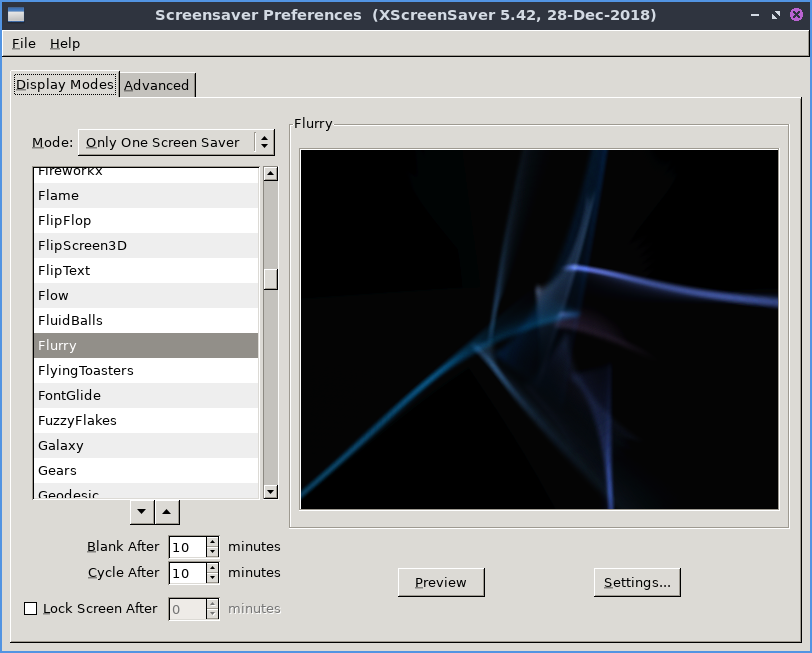

Chapter 3.2.20 Screensaver
==========================

Screensaver is an application to control what screensavers are used on the system. 

Usage
------
The :guilabel:`Mode` drop down has 4 settings Disable turns off the screensaver, :menuselection:`Blank Screen Only` just turns the screen itself off, :menuselection:`Only One Screen Saver` sets one screensaver, and :guilabel:`Random Screen Saver` selects a random screensaver. To set how long it takes your screen to go to the :menuselection:`Screensaver change the field that says :guilabel:`Blank After` to the number of minutes you want the system to be idle before starting the screensaver. If you have a random screensaver set you can change with the number of minutes it says with :guilabel:`Cycle After` for when the screensaver will change to another one. The checkbox for :guilabel:`Lock Screen After` takes the number of minutes to lock the screen and the number of minutes is how many minutes it takes to lock the screen.  

If you try to select a screensaver that is not installed it will not show on the right hand side of the window. To preview a screensaver as when it would be activated press the :guilabel:`Preview` button. To see more settings for each individual screensaver press the :guilabel:`Settings` button.

If you want to kill the daemon :menuselection:`File --> Kill Daemon`. To restart the screensaver daemon :menuselection:`File --> Restart Daemon`. To make the screen blank :menuselection:`File --> Blank Screen Now`.

If you try to open the screensaver settings without having the screensaver daemon running you will bring up a dialog if you want to launch it.

To change to get even more settings on your screensaver use the :guilabel:`Advanced` tab. To have your screen fade to black when blanking check the :guilabel:`Fade to Black when Blanking` checkbox. To have your screen fade back in from screen blanking check the :guilabel:`Fade from Black When Unblanking`. To change how fast your screen fades change the :guilabel:`Fade Duration` field. 

Screenshot
----------

Version
-------
Lubuntu ships with version 5.42 of Screensaver

How to launch
-------------
To launch screensaver from the menu :menuselection:`Preferences --> Screensaver` or run

.. code:: 

   xscreensaver-demo

from the command line. 
