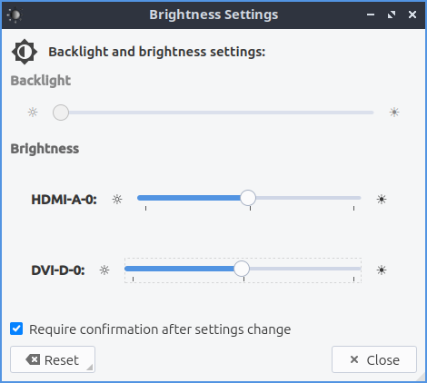

Chapter 2.3.3 Brightness
========================

Brightness is a tool to control your screen brightness. If you are using a laptop turning down your screen brightness can increase battery life by a large amount as well however too dim and the screen will be illegible.

Usage
------
To use brightness click on the dial towards the right window of the window. To make the screen dimmer use the :kbd:`left arrow` key or click on the dial and drag it towards the left. If you want to make the screen more bright press the :kbd:`right arrow` key or drag the dial towards the right. The name of your display(s) will be on a dial on the center. After doing this you will be asked to confirm the current brightness is OK while needing to select :guilabel:`Yes`. If you do not respond it will revert the old brightness which is useful because if you made your screen illegible it will revert to the old settings. 

If you do not want to confirmation uncheck the :guilabel:`Require confirmation after settings change`. To close brightness press the :kbd:`Escape` key.

Screenshot
----------

Version
-------
Lubuntu ships with 0.14.1 of Brightness. 

How to launch
-------------
To launch brightness from the menu :menuselection:`Preferences --> LXQt settings --> Brightness`. Another way is to press the brightness icon on LXQt configuration center or run

.. code:: 

   lxqt-config-brightness 
   
from the commandline.

