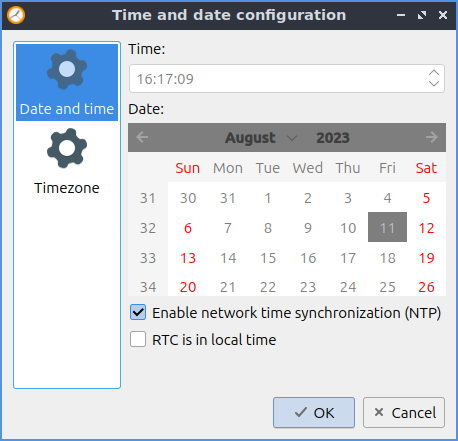
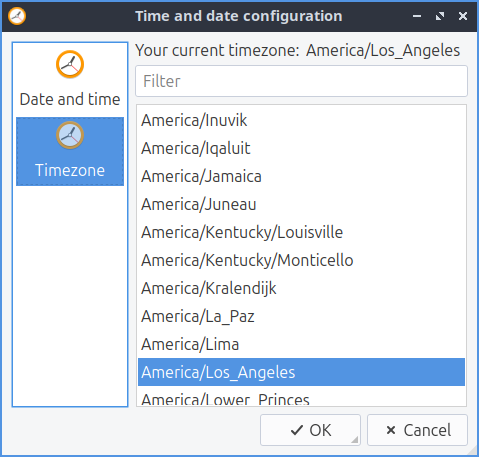

Chapter 3.2.4 Date and Time
===========================

Date and time is a program that lets you change your timezone toggle whether to get the time automatically and change the time and date manually if you are not connected to a network.

Usage
------
The tab for :guilabel:`Date and time` sets what time it is and settings for synchronize it via the network. If you want to toggle synchronizing the time of network check/uncheck  the :guilabel:`Enable network time synchronization(NTP)` check. The checkbox for :guilabel:`RTC is in local time` is for the real time clock on your motherboard being in local time rather than UTC. To change the timezone of your computer left click the :guilabel:`Timezone` tab and select your time zone from the long list. You also can search for your timezone in the search bar that says :guilabel:`Filter` when you type it in and is empty.

If you do not wish to synchronize your clock via network time protocol uncheck the :guilabel:`Enable network time synchronization (NTP)` checkbox. This can also be quite useful if you want to fix the time and  Once NTP is disabled you want to be able to change your time locally you will be able to change your time by typing your time in the correct time in the :guilabel:`Time` field or using the up and down arrows.

To cancel your changes in Date and Time press the :guilabel:`Cancel` button. To close Date and Time press the :kbd:`Escape` key.

Screenshot
----------

Version
-------
Lubuntu ships with version 0.14.1 of Date and time. The icon for Date and Time looks like a watch face.

How to Launch
-------------
To launch Date and Time from the menu :menuselection:`Preferences --> LXQt settings --> Date and Time`. From LXQt Configuration Center under the system settings header at the bottom press the Date and Time button or from the command line run

.. code:: 

    lxqt-admin-time
