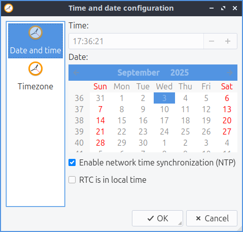

Chapter 3.2.4 Date and Time
===========================

Date and time is a program that lets you change your timezone toggle wheter to get the time automatically and change the date if you are not connected to a network.

Useage
------
If you want to toggle synchronizing the time of network press the radio button of Enable network time synchronization button. To change the timezone of your computer press the timezone gear and select your time zone from the long list.

Screenshot
----------

Version
-------
Lubuntu ships with version 0.13.0 of Date and time. 

How to launch
-------------
To launch date and time from the menu :menuselection:`Prefrences --> LXQt settings --> Date and Time`. From LXQt configuration center under the system settings header at the bottom press the date and time button or from the command line run 

.. code:: 

    lxqt-admin-time
