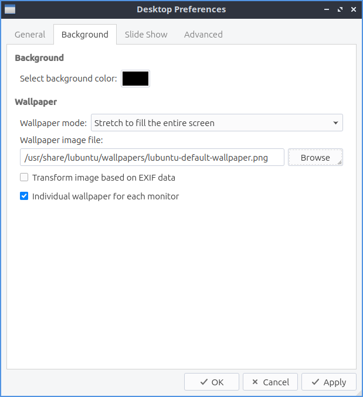

Chapter 3.2.5 Desktop
=====================

Desktop is an application to change the Desktop background and different settings even including slideshows. 

Version
-------
Lubuntu ships with 0.13.0 of Desktop.

Useage
------
To change the desktop background you can either type the path of the file you can type in Wallpaper image file or use the :guilabel:`Browse` to bring up a dialog to choose which the desktop. The drop down of :guilabel:`Wallpaper mode` lets you change how the image you select for a wallpaper changes. If you want an image to have multiple copies of a smaller image select tile image from the drop down. If you do not want an image and just a solid color select fill with background color only. To change the background color if you select that press the button to the right of :guilabel:`Select background color`. 

The drop down menu for :guilabel:`Icon size` lets you choose a different size of desktop icons you can choose a size that looks good on your screen.

The box labeled :guilabel:`Select font` lets you choose which font and size information from a dialog box. On the left is a box for which font to select on on the bottom or type the name on top. The middle lets you choose the font style of the font on your desktop. On the far right is a choice for the size of your font which you can select from the menu. The box  :guilabel:`Select text color` brings up a widget to pick color of either the text color on desktop icons. The field :guilabel:`Select shadow color` changes the shadow on the shadow around the icon. 

The tab :guilabel:`Slide Show` shows settings for slide show of changing your wallpaper automatically like a slide show. The checkbox :guilabel:`Enable Slide Show` enables the slide show that auto changes your wallpaper. The field :guilabel:`Wallpaper image folder` changes the path to find the different pictures for the slideshow or to find a folder press the :guilabel:`Browse` button.  To change how long it takes for the slideshow of the desktop background to change change the fields in :guilabel:`Interval` for changing how fast the slideshow changes. To randomize the order in which the pictures change check/uncheck the :guilabel:`Randomize the slide show` checkbox. 

Screenshot
----------

How to launch
-------------
To launch desktop from the menu :menuselection:`Preferences --> LXQt settings --> Desktop`. Or from LXQt configuration center press the desktop button to launch it or run

.. code:: 

   pcmanfm-qt --desktop-pref
  
from the command line. Another way to launch this is to right click on the desktop :menuselection:`Desktop Preferences`.
