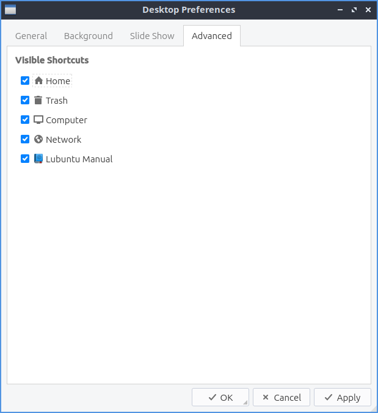

Chapter 3.2.5 Desktop
=====================

Desktop is an application to change the desktop background, the appearance of icons, and even desktop slideshows. 

Usage
------
To change the desktop background you can either type the path of the file you can type in :guilabel:`Wallpaper image file` or use the :guilabel:`Browse` to bring up a dialog to choose which the desktop. The drop down of :guilabel:`Wallpaper mode` lets you change how the image you select for a wallpaper changes. If you want an image to have multiple copies of a smaller image select tile image from the drop down. If you do not want an image and just a solid color select fill with background color only. To change the background color if you select that press the button to the right of :guilabel:`Select background color`. 

The drop down menu for :guilabel:`Icon size` lets you choose a different size of desktop icons you can choose a size that looks good on your screen. The box  :guilabel:`Select text color` brings up a widget to pick the color on desktop icons and files. The field :guilabel:`Select shadow color` changes the shadow on the shadow around the icon. To change the margins change the fields for :guilabel:`Minimum item margins` field for different coordinates. To make the margins always the same number of pixels check the :guilabel:`Lock` checkbox.

.. image:: desktop.png

The box labeled :guilabel:`Select font` lets you choose which font and size information from a dialog box. On the left is the :guilabel:`Font` for which font to select on on the bottom or type the name on top. The middle lets you choose the :guilabel:`Font style` of the font on your desktop. On the far right is a choice for the :guilabel:`Size` of your font which you can select from the menu. To have your text of your font underlined check the :guilabel:`Underline` checkbox. To change what languages your fonts can support choose your language in the :guilabel:`Writing System` drop down menu. To preview how the text will appear look in the :guilabel:`Sample` box.

The :guilabel:`Slide Show` tab shows settings for slide show of changing your wallpaper automatically like a slide show. The checkbox :guilabel:`Enable Slide Show` enables the slide show that auto changes your wallpaper. The field :guilabel:`Wallpaper image folder` changes the path to find the different pictures for the slideshow or to find a folder press the :guilabel:`Browse` button.  To change how long it takes for the slideshow of the desktop background to change change the fields in :guilabel:`Interval` for changing how fast the slideshow changes. To randomize the order in which the pictures change check the :guilabel:`Randomize the slide show` checkbox. 

.. image::  slideshow-desktop.png

The :guilabel:`Advanced` tab has settings for automatic desktop icons or included or to show openbox menus on click the desktop. To show or hide any of the desktop icons check/uncheck the checkboxes for: :guilabel:`Home`, :guilabel:`Trash`, :guilabel:`Computer`, or :guilabel:`Network`. To show the openbox window manager menus by right clicking on the desktop check the :guilabel:`Show menus provided by window managers when desktop is clicked`.

To quit Desktop press the :kbd:`Escape` key.

Version
-------
Lubuntu ships with 0.14.1 of Desktop.

How to Launch
-------------
To launch Desktop from the menu :menuselection:`Preferences --> LXQt settings --> Desktop`. Or from LXQt Configuration Center press the desktop button to launch it or run

.. code:: 

   pcmanfm-qt --desktop-pref=general
  
from the command line. Another way to launch this is to right click on the desktop :menuselection:`Desktop Preferences`. The desktop icon for Desktop Preferences is a gray rectangle with a small hole missing.
