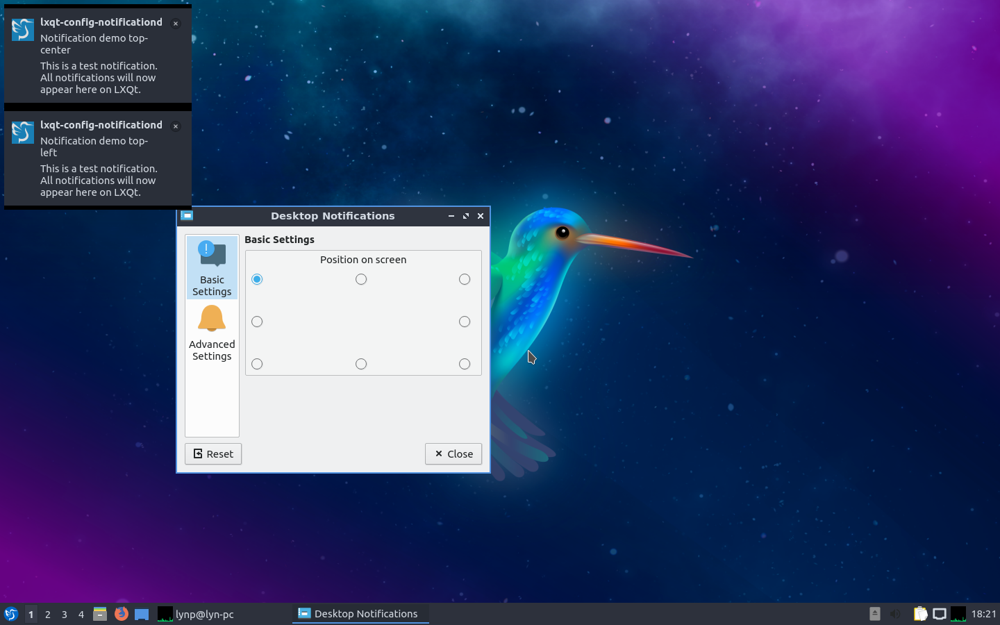
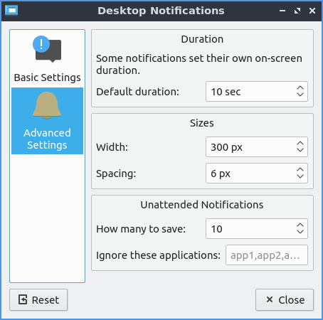

Chapter 3.2.6 Desktop Notifications
===================================

Desktop notifications are the settings for your desktop notifications such as when someone mentions your name on internet relay chat or the first time you run to configure your power management settings.

Usage
------
The :guilabel:`Basic Settings` tab lets you change where Desktop notifications appear on your screen click the button that appears on the portion of your screen where you want them with the outline being your window. To quit the desktop notifications press the :kbd:`Escape` key.

On the :guilabel:`Advanced Settings` tab lets you change duration of desktop notifications and their spacing.  The :guilabel:`Default duration` is how long to show a notification for with a default of 10 seconds. The sizes :guilabel:`Width` field lets you choose how wide to make notifications. The :guilabel:`Spacing` field changes how far to place the notification from each other. If you want to deal with notification when you are not directly at your computer have use the settings under :guilabel:`Unattended Notifications`. To change how many desktop notifications get saved change the :guilabel:`How many to save` field. To ignore particular applications type the application name in the :guilabel:`Ignore these applications` field.  

Screenshots
-----------

Version
-------
Lubuntu ships with version 0.14.1 of desktop notifications.

How to launch
-------------
To launch Desktop notifications from the menu :menuselection:`Preferences --> LXQt settings --> Desktop Notifications`. In LXQt Configuration Center press the Desktop Notification button which looks like a giant !. You can also launch Desktop Notifications from left clicking on the docked notifications and :menuselection:`Options`. To launch the Desktop Notifications from the command line run

.. code:: 

   lxqt-config-configurationd 
