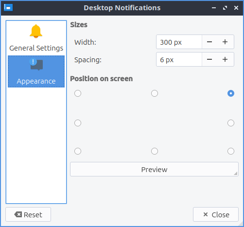

Chapter 3.2.6 Desktop Notifications
===================================

Desktop Notifications is the program that changes desktop notification settings such as when someone mentions your name on internet relay chat or the first time you run to configure your power management settings.

Usage
------

To quit the desktop notifications press the :kbd:`Escape` key or press the :guilabel:`Close` button. To reset your changes press the :guilabel:`Reset` button.

The :guilabel:`General Settings` tab lets you change the duration of desktop notifications and their spacing. The :guilabel:`Default duration` field sets how long to show a notification with a default of 10 seconds. The :guilabel:`Width` field lets you choose how wide to make notifications. The :guilabel:`Spacing` field changes how far to place the notifications from each other. 

If you want to deal with notification when you are away from your computer use the settings under :guilabel:`Unattended Notifications`. To change the max number of notifications change the :guilabel:`How many to save` field. To ignore particular applications type the application name in the :guilabel:`Ignore these applications` field.

To not be disturbed by notifications check the :guilabel:`Only save notifications` checkbox. To show notifications on the monitor with the mouse check the :guilabel:`Show notifications on screen with the mouse` checkbox.

The :guilabel:`Appearance` tab lets you change where Desktop notifications appear on your screen. Click the button that appears under :guilabel:`Position on screen` on the portion of your screen where you want them with the outline being your window. To test where a notification will pop up press the :guilabel:`Preview` button.

Screenshots
-----------

Version
-------
Lubuntu ships with version 1.4.0 of Desktop Notifications.

How to Launch
-------------
To launch Desktop Notifications from the menu :menuselection:`Preferences --> LXQt settings --> Desktop Notifications`. The icon for Desktop Notifications looks like a ! in a chat bubble. You can also launch Desktop Notifications from left clicking on the docked notifications tray icon and :menuselection:`Options`. To launch the Desktop Notifications from the command line run

.. code:: 

   lxqt-config-configurationd 
