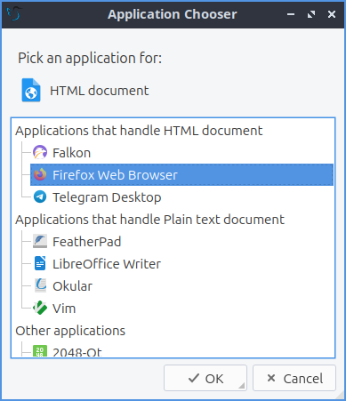
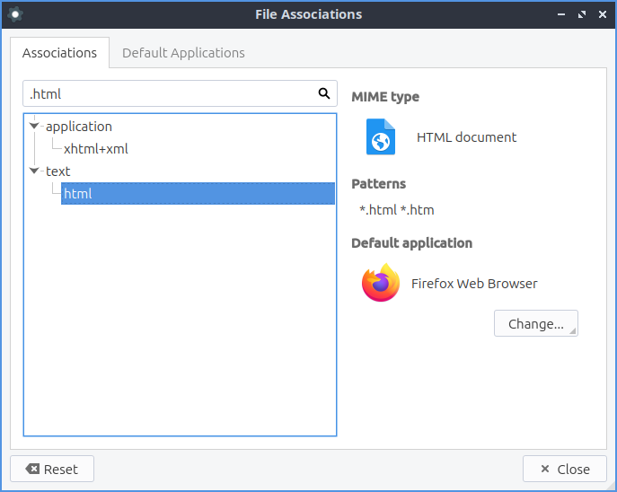

Chapter 3.2.7 File Associations
===============================

File Associations changes the default application to open a file.

Usage
------
To change which filetype to use for applications use the :guilabel:`Associations` tab. To search for which file extension you want to change to open in another program you can search in the top box with a magnifying glass for that file format. On the left is really long collapsible list of all mimetypes that you can change look through but searching will be much faster. To expand a particular group of mimetypes from the group on the left press the :guilabel:`+` button. To collapse a group of mimetypes press the :guilabel:`-` button. Once you find the filetype you want to change on the top right it tells you what kind of file that :guilabel:`MIME type` is. To see what file name extensions usually used for this kind of file read the :guilabel:`Patterns` field. The current default is shown on the lower right with a :guilabel:`Change` button that brings up a menu for you to change it to something else. If you do not have a default application set you can press the :guilabel:`Choose` button to set a default button. To change a default press the :guilabel:`Change` button and it brings up a menu to choose the new default program for this kind of file.

To choose several common programs to end up using as default application use the :guilabel:`Default Applications` tab. For each application to change to a different default application press the :guilabel:`Change` button.

To reset your changes press the :guilabel:`Reset` button if you don't want to keep your buttons. Once you are happy with your choices press the :guilabel:`Close` button or press the :kbd:`Escape` key. 

Screenshot
----------

Version
-------
Lubuntu ships with version 2.1.0 of File Associations

How to Launch
-------------
From the menu :menuselection:`Preferences --> LXQt settings --> File Associations` or from the command line run

.. code:: 

   lxqt-config-file-associations 
   
The icon for File Associations is a gear with a white circle on top.

