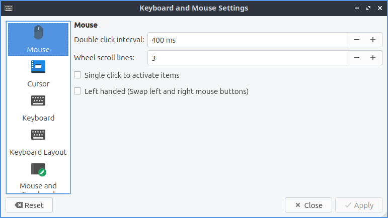
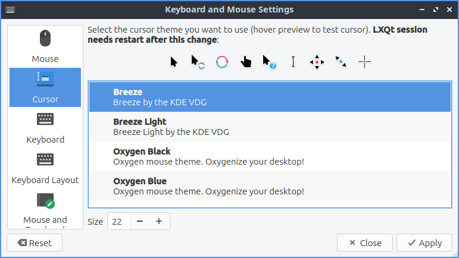
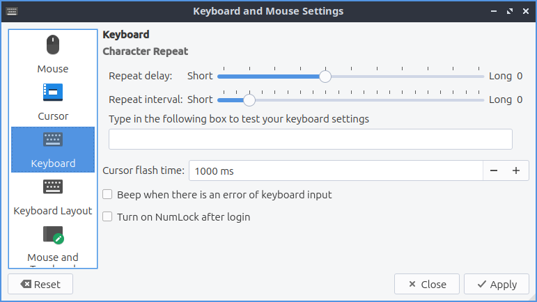
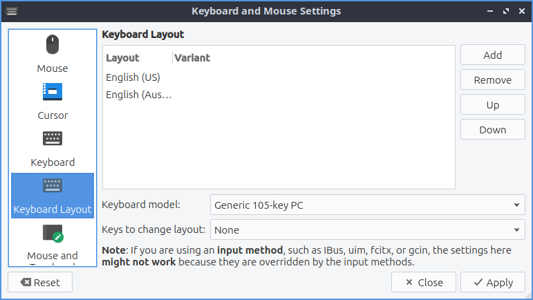
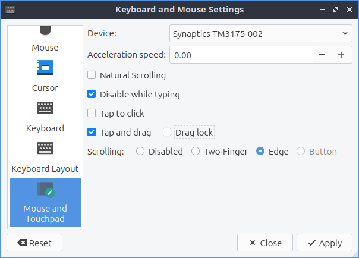

Chapter 3.2.8 Keyboard and Mouse
================================

Keyboard and Mouse is a program to change the behavior of your keyboard and mouse.

Version
-------
Lubuntu ships with version 0.14.1 of Keyboard and Mouse.

Usage
------
The :guilabel:`Mouse` tab provides settings for how fast the mouse moves scrolls and double clicks. To increase the sensitivity of the mouse drag the slider for :guilabel:`Sensitivity` towards the right or conversely to decrease sensitivity drag the slider towards less sensitivity. To increase acceleration of the mouse drag the :guilabel:`Acceleration` slider to the right for more acceleration and to make the mouse accelerate slower drag it to the left. The settings should apply immediately so make sure the mouse moves how you want it.

If you do not like the new settings press the :guilabel:`Reset` button to go back to your previous settings. If you want to close Keyboard and Mouse press :kbd:`Escape` key.

The :guilabel:`Wheel scroll lines` field changes how many lines of text you scroll when you use the scrollwheel. If you wish to only have to tap once to perform a left click check the :guilabel:`Single click to activate items` checkbox. If you wish to swap left and right buttons on your mouse check the :guilabel:`Left handed` checkbox. Note that this also swaps the button on a touchpad. 

The :guilabel:`Cursor` tab on the left lets you change your cursor theme which is quite useful if you are say running virtual machines so the cursor does not look the same in the host and the guest. To change a theme scroll down to which theme you want under preview but you will have to logout and log back in again for this to fully take effect. 

The :guilabel:`Keyboard` tab has settings for changing keyboard settings. If you want to change how quickly it takes to repeat a keyboard shortcut move the slider to the right on the :guilabel:`Repeat delay` to take longer to repeat key presses or to the left to decrease the time it takes to repeat. The :guilabel:`Repeat interval` is how quickly after the repeat delay the held down key will repeat itself which moving to the right will make it take longer to increase while to the left will make it take a short time to repeat itself.  To test your keyboard settings type in the :guilabel:`Type in the following box to test your keyboard settings` text box. To change how fast the keyboard flashes change the :guilabel:`Cursor flash time` field. The :guilabel:`Turn on numlock after login` checkbox will make numlock automatically be on after you login.
 

The :guilabel:`Keyboard Layout` tab has settings to add a new keyboard layout. In the top center of the window is a listing of your current keyboard layout and any variant applied to it. To add a keyboard layout press the :guilabel:`Add` button. To remove the keyboard layout left click on the keyboard and press the :guilabel:`Remove` button. To move a keyboard layout up or down press the :guilabel:`Up` or :guilabel:`Down` buttons. To change your keyboard model in choose your keyboard model in the :guilabel:`Keyboard model` drop down. 

The :guilabel:`Mouse and Touchpad` tab has settings for touchpads. To select which device to change settings use the :guilabel:`Device` drop down menu. To change how fast your touchpad accelerates use the :guilabel:`Acceleration speed` field. To reverse the scrolling direction check the :guilabel:`Natural Scrolling` checkbox this kind of scrolling is common on devices with touchscreens. To tap the touchpad once to register a left click check the :guilabel:`Single click to activate items` checkbox. To tap on the touchpad to drag items instead of having to click on the button and use the touchpad at the same time check the :guilabel:`Tap to drag` checkbox. To disable scrolling by the touchpad press the :guilabel:`Disabled` button to the right of :guilabel:`Scrolling`. To use two fingers to scroll on the touchpad press the :guilabel:`Two-Finger` button. To use the edge of the touchpad to scroll press the :guilabel:`Edge` button.

How to launch
-------------

To launch Keyboard and Mouse use menu :menuselection:`Preferences --> LXQt settings --> Keyboard and Mouse`. In LXQt configuration center press the keyboard and mouse button or from the command line run

.. code:: 

   lxqt-config-input
