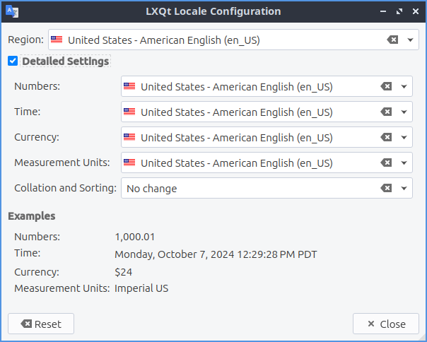

Chapter 3.2.9 Locale
====================

Locale changes your locale which changes your language and how things are translated on your desktop environment. 

Screenshot
----------

Usage
------
To change your locale the :guilabel:`Region` shows the name of your local and in the drop down menu you can type the name of your locale to search through the locales or scroll through the long list. Under the :guilabel:`Examples` will show how numbers Time Currency and measurement units will be shown on your system. If you do not like the changes you can press the :guilabel:`Reset` button. To close Locale press the :kbd:`Escape` key.

The checkbox for :guilabel:`Detailed Settings` allows for even more customization. To change how the thousands separator and decimal point appear in number change the :guilabel:`Numbers` drop down menu. To change the order of the time and date choose the :guilabel:`Time` drop down menu. To change how currency appears on your system change the :guilabel:`Currency` drop down menu for currency. To change which measurement units change the :guilabel:`Measurement Units` drop down.
 
Version
-------
Lubuntu ships with version 0.14.1 of Locale. 

How to Launch
-------------
To launch locale from the menu :menuselection:`Preferences --> LXQt settings --> Locale` or run

.. code:: 

   lxqt-config-locale 
   
from the command line. In LXQt Configuration Center press the locale button that looks like a flag. 
