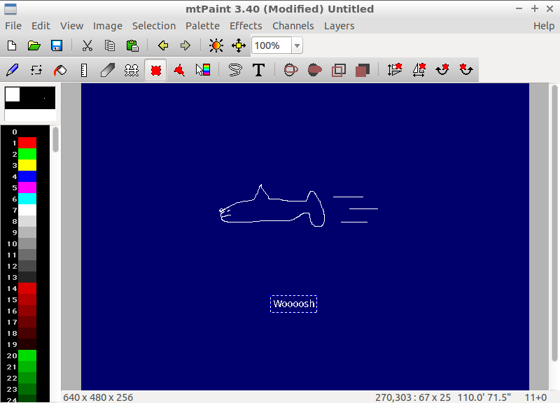

Chapter 3.3.1: mtPaint
======================

Description
-----------
mtPaint (Mark Tyler's Painting Program) is a painting program which Mark Tyler developed from scratch so he could easily create pixel art and manipulate digital photos.

It uses the GTK+ toolkit (version 1 or 2) and runs on PC's via the GNU/Linux or Windows operating systems. Due to its efficient design it can run on older PC hardware (e.g. a 200MHz CPU and 16MB of free RAM).

Screenshot
----------

Version
-------
Lubuntu currently ships with mtPaint v3.4.0.

How to launch
-------------
Go to the Applications Menu > Graphics > mtPaint graphic editor.

mtpaint -s can be used to grab a screenshot and import it into mtpaint.