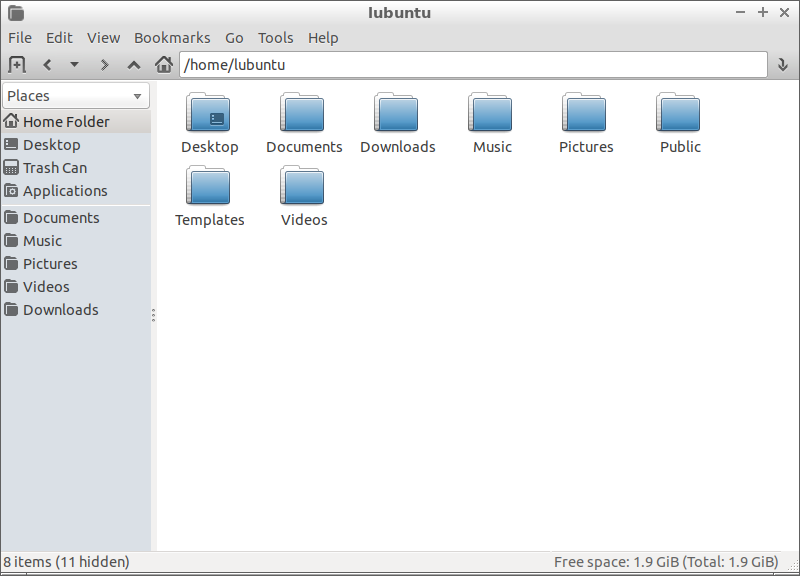

Chapter 3.3.2: PCManFM
============================

Description
------------
PCManFM (PCMan File Manager) is a file manager application developed by Hong Jen Yee from Taiwan which is meant to be a replacement for Nautilus, Konqueror and Thunar. 

Screenshots
------------------

Version
-------
Lubuntu currently ships with v1.2.5.

How to Launch
-------------
To open PCManFM in your current directory (in terminal), execute `pcmanfm`.

Feel free to append [sudo] to run PCManFM as root.

You can also go to the Applications Menu > Accessories > File Manager PCManFM.