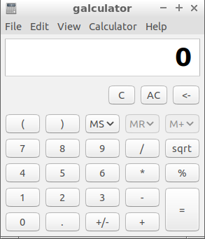

Chapter 3.3.3: Galculator
=========================

Description
-----------
Galculator is a scientific calculator application. It has a basic mode, a scientific mode, and a paper mode.

Screenshot
----------

Version
-------
Lubuntu ships Galculator with version 2.1.4.

How to launch
-------------
To launch Galculator, open the main menu and click the icon that looks like a calculator under Accessories; or, you can launch it by running galculator in the terminal.
