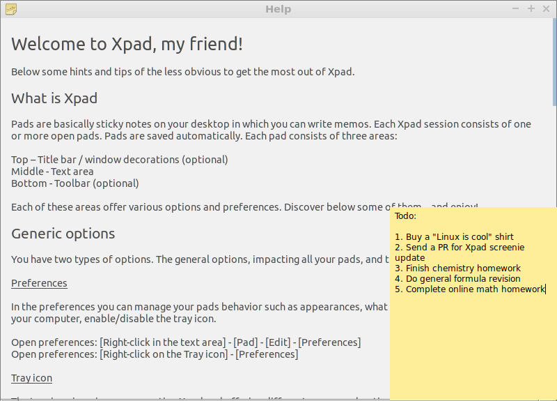

Chapter 3.3.6: Xpad
===================

Description
----------
Xpad is an application for making notes on your desktop. It features clipboard interaction, basic styling, and other features that generally come with a notes system.

Screenshot
----------

Version
-------
Lubuntu ships with version 5.0.0 of Xpad.

How to Launch
-------------
To launch Xpad, go to the Main Menu, go to Accessories, then click the icon that looks like a yellow sticky note; or, you can run xpad from the terminal.
