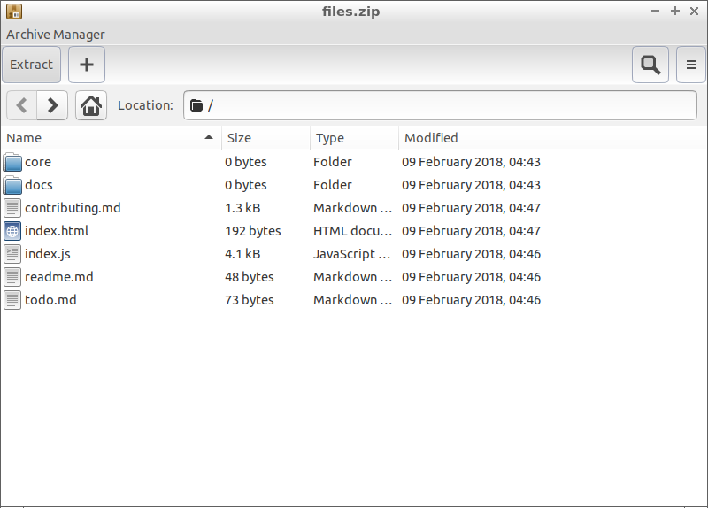

Chapter 3.3.7: Archive Manager
==============================

Description
-----------
Archive Manager (File-roller) for the GNOME environment.

Currently, Archive Manager has the following features:
 - Create and modify archives.
 - View the content of an archive.
 - View a file contained in an archive.
 - Extract files from the archive. File-roller supports the following formats:
 - Tar (.tar) archives, including those compressed with gzip (.tar.gz, .tgz), bzip (.tar.bz, .tbz), bzip2 (.tar.bz2, .tbz2), compress (.tar.Z, .taz), lzip (.tar.lz, .tlz), lzop (.tar.lzo, .tzo), lzma (.tar.lzma) and xz (.tar.xz)
 - Zip archives (.zip)
 - Jar archives (.jar, .ear, .war)
 - 7z archives (.7z)
 - iso9660 CD images (.iso)
 - Lha archives (.lzh)
 - Archiver archives (.ar)
 - Comic book archives (.cbz)
 - Single files compressed with gzip (.gz), bzip (.bz), bzip2 (.bz2), compress (.Z), lzip (.lz), lzop (.lzo), lzma (.lzma) and xz (.xz) File-roller can extract following formats:
 - Cabinet archives (.cab)
 - Debian binary packages (.deb)
 - Xar archives (.xar) File-roller doesn't perform archive operations by itself, but relies on standard tools for this.

Screenshots
-----------

Version
-------
Lubuntu currently ships with v3.26.1.

How to Launch
-------------
To open Archive Manager on a archive, double click on the archive and it archive manager will show the archive contents

You can also go to the Applications Menu > Accessories > Archive Manager
