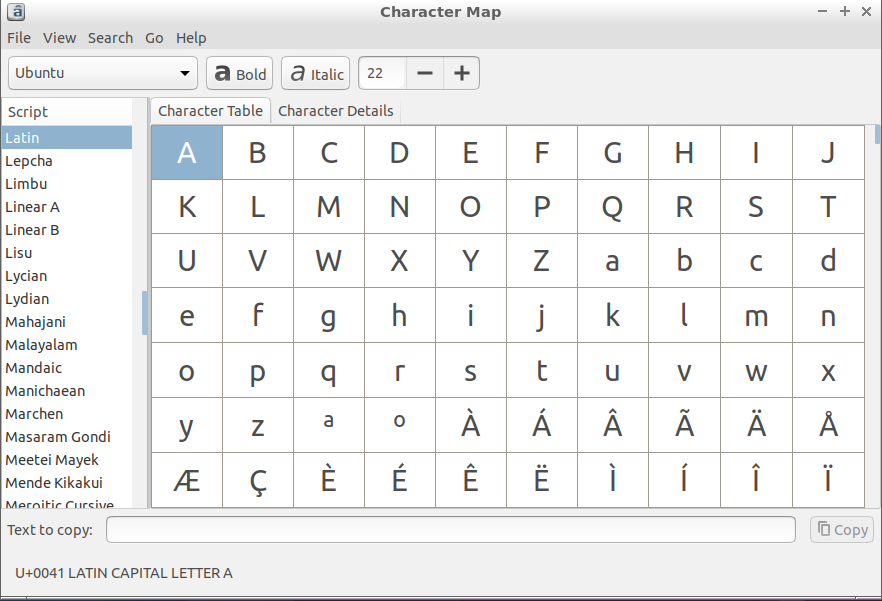

Chapter 3.3.8: Character Map
============================

Description
------------
Character Map allows you to type symbols that normally you may not have a key for on your keyboard (i.e. if you want to use a character from another language).

Usage/Screenshots
------------------
A really useful keyboard shortcut is Ctrl + F to search for symbols which can make finding the correct one much faster.

Version
-------
Lubuntu currently ships with version 1.10.0.

How to Launch
-------------
To open Character Map, in the main menu, go to Accessories and click on the icon that looks like A with a ~ over it. Or from the terminal, run gucharmap.
