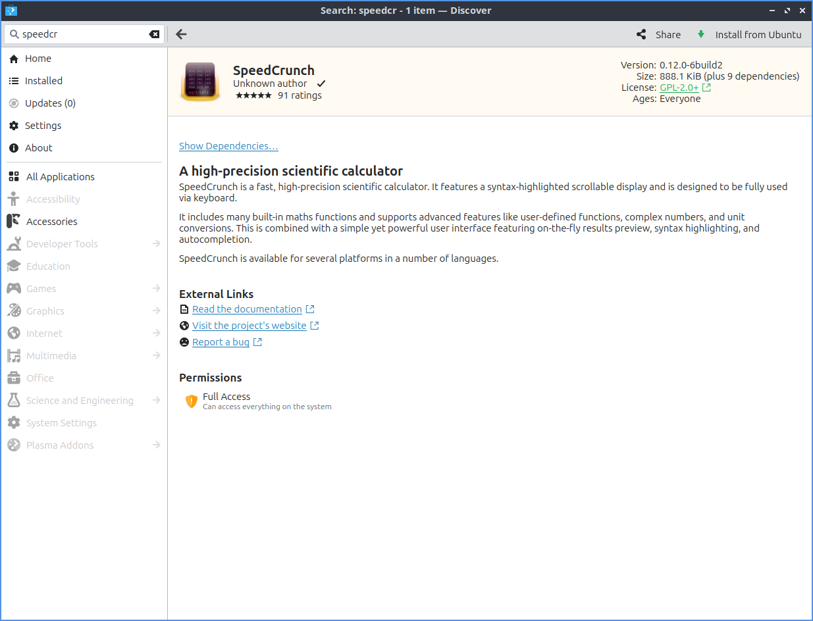
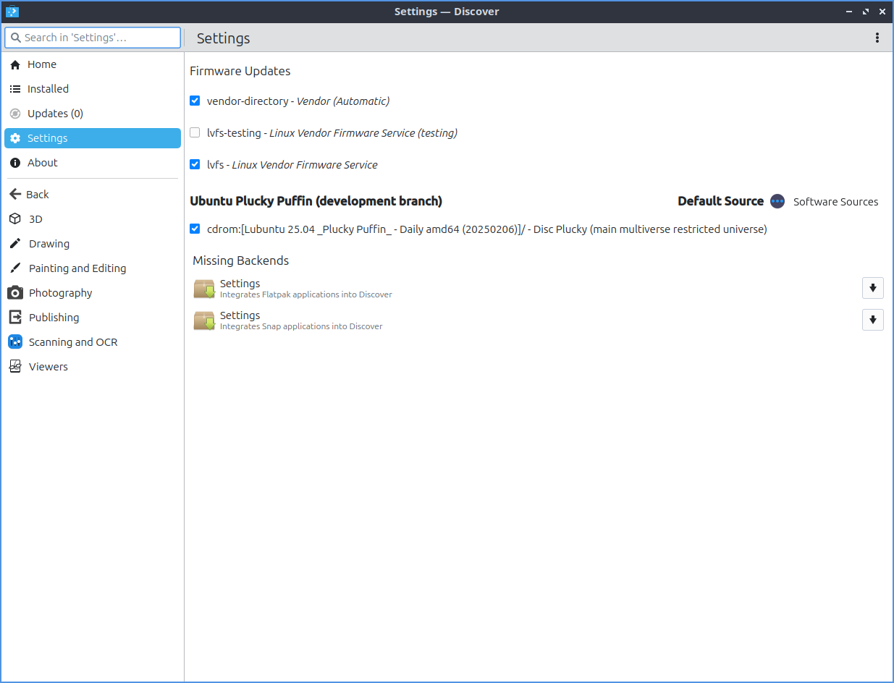

Chapter 4.1 Discover Software Center
==========================================
Discover allows you to install and remove programs and utilities. It has a simplistic interface making it easy to navigate and use. However, Discover only shows GUI applications so if you are looking for command line packages please use Muon Package Manager instead.

Usage
------
Discover allows you to search for applications by using the :guilabel:`Search` box or by pressing :kbd:`Control + F`. To view featured applications press the :guilabel:`Home` button in the top  of the bottom left hand corner. Left clicking on a program will give you a description of it. To install a program press the cloud with downward pointing arrow button that says :guilabel:`Install` when viewing a single package. When installing or removing software, you will be prompted for your password. You can also browse through different categories on the left clicking on the different categories. If a category has a :menuselection:`-->` next to it you can click on it and then will have subcategories. To go back up a little press the :guilabel:`Back` button in the upper left. In the results after selecting your program you are looking at you can select a screenshot and get a bigger view of the screenshot click on the screenshot. To change which screenshot you are looking at press the left and right arrow buttons near the screenshot. To exit from the screenshot press :kbd:`Escape` or click not on the screenshot. To navigate back to the start with press the button that looks like a house.

Press the leftward pointed arrow button to moves back in your history. 

To view more information on a program you want to install left click on a program to see more details on it. Towards the right will show a description of the program. To view user reviews of a program click on the text :guilabel:`Show All Reviews`. To install the program press the :guilabel:`Install` button. To view more screenshots press the left and right arrows next to the screenshots. To exit the user reviews press :kbd:`Escape` or click outside the areas of reviews. To view ratings of thee program is shown in stars with how many ratings of the number of reviews next to :guilabel:`ratings`.  Below the reviews there is information on the package such as the :guilabel:`Version` and :guilabel:`License`. 

To remove software use the :guilabel:`Installed` tab or press :kbd:`Alt +I`. You can browse your installed packages, search using the search bar (upper left corner), and the click the remove button to remove software by pressing the :guilabel:`Remove` button. To view more details on the program left click on it. If you want to launch an installed program press the :guilabel:`Launch` button in the upper right corner.

.. image:: discover-installed.png

In the upper right corner of discover you can have a :guilabel:`Sort` category to sort your search results by :menuselection:`Name`, :menuselection:`Rating`, :menuselection:`Size`, or :menuselection:`Release Date`.  

To get to your settings on what software to use install use the :guilabel:`Settings` tab. To remove a source such as a PPA click the hidden red :guilabel:`X` button on the right hand side of to remove it. To toggle enabling or disabling a software source check or uncheck the checkbox next to that software source. To make snap packages the default version to use for discover press the :guilabel:`Make default` button next to Snap packages. To switch back to deb packages as default press the three vertical dots button and then select :menuselection:`Make default`.

Updating
--------

Discover allows you to update software using the Updates tab located on the bottom of the left column. You can click the :guilabel:`Check for Updates` button to check for updates manually. If you have updates that need to be installed  instead it will say in orange :guilabel:`Update(x)` where x is the number of the packages needing updating or press :kbd:`Alt+U`. When you select updates to install and have updates towards the upper left shows you the number of packages to update and the size of the download in parenthesis. To not select an update to install uncheck the the checkbox to the left of the package. To see the what version will be upgraded on your system will show the old version :menuselection:`-->` new version  with how much the download size of the update to the right. To see what is changing in a package with the changelog double left click on the package and then read what has changed in the update. To view info about a package being updated left click on it and then left click :guilabel:` More information` .
 To select all packages to update press the :guilabel:`Select All` button. To select none of the packages press the :guilabel:`Select None` button.
  
To check if there are anymore updates again press the :guilabel:`Refresh` button on the top bar. To finally update press the :guilabel:`Update All` button to install all updates and then a dialog will pop up you will need to enter your password and press the :guilabel:`OK` button to make sure you are the one installing these updates. If you need to restart after updating on your updates you will see the text :guilabel:`The system requires a restart to apply updates` and press the :guilabel:`Restart` button to restart your machine.

.. image:: update-authentication.png

Screenshot
----------

.. image:: discover_screen.png

Version
-------
Lubuntu ships with version 5.27.2 of Discover.

How to Launch
-------------
To launch Discover from the menu :menuselection:`System Tools --> Discover` or run 

.. code:: 

   plasma-discover 
   
from the command line. The icon for Discover looks like a blue circle with a white downward pointing arrow.

